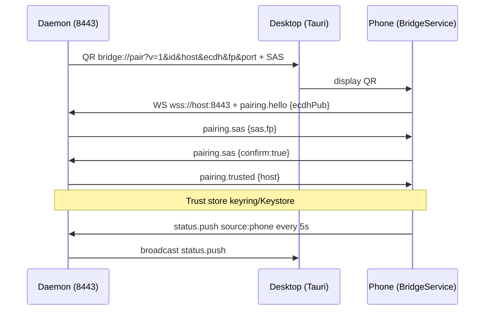
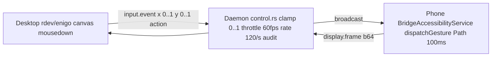
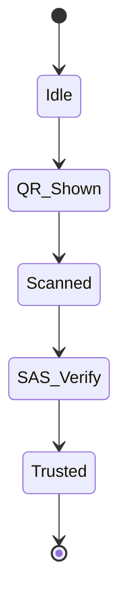
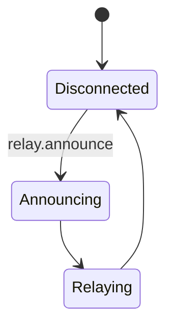

# BRIDGE — Linux ↔ Android Continuity Platform
## Master Prompt / Project Bible  — Everything In One File
> **Use this file as the single source of truth to recreate, extend, or handoff Bridge.** Paste it into any LLM (or give to a new dev) and it will understand the entire system: why it exists, how it connects, every feature, every file, every protocol, every test. No other doc needed.

---

### 0. Elevator
**Bridge** is an open, LAN-first, E2E-encrypted, Apple-Continuity-like platform that pairs **Android 10+** with **Linux (Ubuntu 24.04 MVP, later Windows/macOS)** over **mDNS + BLE + WS 8443 + QUIC + WebRTC**, with **no cloud, no DB, no Render deployment for core**. A `Tauri v2 (Rust + React)` desktop app and a `Kotlin + Compose` Android app both talk to a `Rust Tokio` daemon (`bridge-daemon`) that brokers discovery, pairing, transport, and 7 service meshes. **Render hobby** is only for an optional static landing (`apps/desktop/dist`).

**One-liner:** *Phone ↔ Mac for Linux — clipboard, files, notifications, webcam, mic, screen, calls, SMS, control, storage, relay, mesh, plugins, AI — all LAN.*

---

### 1. Why / Product Vision
- **Problem:** KDE Connect is fragmented, Pushbullet needs cloud, Scrcpy is only screen. No single E2E LAN app does Continuity.
- **Principles:** LAN-first, E2E (`Noise XX` + `TLS 1.3` pinned self-signed, `ECDH P-256`), idle `<10% CPU` `<250 MB`, discover `<2s`, pairing `<10s`, audio `<50ms`, webcam `<100ms`, mirror `<70ms`, modular services, per-feature toggles, open.
- **Scope (MVP from `docs/SRS.md:1-200`):** secure discovery/pairing, reconnect, file share, clipboard, notifications, camera→webcam, mic, speaker streaming, mirroring, device status. **Post-MVP (this plan):** Calls/SMS via desktop, Mobile hotspot trigger, Workflow automation, Global relay, Plugin platform, Multi-device, AI (notification summarization, call transcription via `whisper.cpp`/`llama.cpp` or **OpenCode Zen** cloud).

---

### 2. Tech Stack (ADR-001 `docs/ADR-001-tech-stack.md:1-80`)
| Layer | Choice | Why |
|-------|--------|-----|
| **Desktop UI+Daemon** | **Tauri v2 (Rust + WebKitGTK) + React 18 + Vite + TypeScript + Tailwind + shadcn/ui** | 15-30 MB binary, `<50 MB` RAM idle vs Electron 300+; `Tokio` for transport; `tray`/`single-instance`/`autostart` |
| **Shared core** | `crates/bridge-core` Rust (`serde`/`p256`/`hkdf`/`sha2`/`base64`/`qrcode`) + parity schemas | Single crypto/protocol, no TS/Kotlin drift |
| **Control** | `TLS 1.3` `WebSocket` `tokio-tungstenite` + `rustls` `0.0.0.0:8443` | Browser-compatible signalling |
| **Bulk** | `QUIC` `quinn` `0.11` multiplexed 1 MB chunks `SHA256` `9443/udp` | 0-RTT reconnect, no HOL, resume |
| **Discovery** | `mDNS` `mdns-sd` `0.13` (desktop) + `NsdManager`/`JmDNS` (Android) primary, `BLE` `btleplug` + `Android advertise` secondary, `Wi-Fi Direct` future | `<2s` on LAN, BLE solves isolated AP |
| **Pairing** | QR `bridge://pair?v=1&id&host&ecdh&fp&port=8443` + `ECDH P-256` + `SAS 6-digit` + `Noise XX` / `TLS 1.3` pinned, keys `keyring` (`libsecret`) / `Keystore+EncryptedSharedPreferences` | LAN-only, MITM resistant |
| **Media** | `WebRTC` `webrtc-rs` / `Pion` `Opus 48k` `H.264` HW fallback `VP8/AV1`, `webrtc-audio-processing` EC/NS | Latency targets |
| **Virtual devices** | `v4l2loopback` `/dev/video10` `Bridge Cam`, `PipeWire` virtual `Bridge Mic`/`Bridge Speaker`, `xdg-desktop-portal ScreenCast` | Meet/Zoom native |
| **Android** | `Kotlin` + `Jetpack Compose` + `CameraX` + `MediaProjection` + `NotificationListenerService` + `DataStore` + `WorkManager` + `OkHttp` WS | Only way for `FG service`, `MediaProjection`, `RemoteInput` |
| **Build** | `pnpm workspaces`, `Cargo` workspace, `Gradle 8` Kotlin DSL, `just`, `GitHub Actions` | |

**Rejected:** Electron (RAM), Flutter/RN (no `NotificationListener`/`FG` reliability), Raw RTP (no congestion), WS-only bulk (no resume).

**Host probe (Ubuntu 24.04):** `Node 24.14` `Rust 1.98` `Java 21` `adb 34.0.4` `pnpm 11.24` `cargo-tauri 2.11.4` `v4l2loopback 0.12.7` `/dev/video10` `PipeWire 1.0.5` `avahi`. **Sudo `123`** for `apt` `libwebkit2gtk-4.1-dev` etc via `scripts/setup-linux.sh`.

---

### 3. Monorepo Layout (`/home/mylappy/Projects/bridge`)
```
bridge/
├─ Cargo.toml                 # workspace ["crates/bridge-core","crates/bridge-daemon","apps/desktop/src-tauri"]
├─ pnpm-workspace.yaml        # ["apps/desktop"]
├─ package.json               # private workspaces ["apps/desktop"]
├─ justfile                   # dev/check/test/android/lint
├─ render.yaml                # Render Hobby free static (no DB) → apps/desktop/dist
├─ .env.example               # OPENCODE_ZEN_API_KEY=… (user will fill)
├─ Bridge_Complete_IEEE_SRS_Blueprint.docx  # IEEE SRS (duplicate removed)
├─ docs/
│  ├─ SRS.md                  # Exported from docx (14 sections, 171 paras)
│  ├─ ADR-001-tech-stack.md
│  ├─ ARCHITECTURE.md         # C4 L1-3 + flows + state machines (see §4)
│  ├─ PROTOCOL.md             # BridgeMessage {v,id,type,ts,nonce,payload} + all schemas (see §5)
│  ├─ SECURITY.md             # Threat model, key lifecycle, checklist
│  ├─ API-CONTRACTS.md        # Tauri invoke + WS
│  ├─ SETUP.md                # Host deps + OPENCODE_ZEN_API_KEY + LAN/Bluetooth + no DB
│  ├─ ROADMAP.md              # MVP 0-8
│  ├─ ROADMAP-POST-MVP.md     # Deep beyond MVP (telephony, control, storage, relay, mesh, plugins, AI)
│  ├─ PHASE-3-TELEPHONY.md / PHASE-4-CONTROL.md / PHASE-5-STORAGE.md / PHASE-6-RELAY.md / PHASE-7-PLUGINS.md
│  ├─ TEST-STRATEGY.md        # 80% TDD (unit+integration+E2E)
│  ├─ MVP-VERIFICATION.md     # Gates 2026-08-29
│  └─ BRIDGE_MASTER_PROMPT.md # ← you are here
├─ crates/
│  ├─ bridge-core/src/{lib.rs,protocol.rs,crypto.rs,file.rs,pairing.rs}  # p256, hkdf, chunker 1 MB, QR
│  │  └─ tests/protocol_test.rs
│  └─ bridge-daemon/src/{main.rs,discovery.rs,pairing.rs,transport.rs}  # Tokio WS 8443 + mDNS + http peek
│     └─ services/{mod.rs,router.rs,clipboard.rs,file.rs,notify.rs,status.rs,media.rs,telephony.rs,control.rs,storage.rs,relay.rs,mesh.rs,plugin.rs,ai.rs}
├─ apps/
│  ├─ desktop/                # Vite React
│  │  ├─ package.json         # react 18.3, zustand, qrcode.react, vite 5.4, tailwind 3.4, vitest 2.1
│  │  ├─ vite.config.ts       # server.host 0.0.0.0:1420 (LAN)
│  │  ├─ tailwind.config.js   # bridge.bg #0a0a0f card #14141c border #262636 accent #6c5cff
│  │  ├─ src/
│  │  │  ├─ lib/{bridge.ts,store.ts,telephony.ts,control.ts,storage.ts,relay.ts,mesh.ts,plugin.ts,ai.ts}
│  │  │  ├─ components/{Pairing.tsx,Status.tsx,Files.tsx,Clipboard.tsx,Notifications.tsx,Media.tsx,Telephony.tsx,RemoteControl.tsx,Storage.tsx,Plugins.tsx}
│  │  │  └─ App.tsx            # 7 tabs: overview/files/media/telephony/control/storage/plugins
│  │  └─ src-tauri/{Cargo.toml,tauri.conf.json,main.rs,build.rs,icons/icon.png (512 RGBA)}
│  └─ android/                # Kotlin
│     ├─ build.gradle.kts / settings.gradle.kts / gradle.properties (compileSdk 34, minSdk 26, compose 1.5.13)
│     ├─ gradle/wrapper/gradle-wrapper.properties (gradle 8.7)
│     └─ app/src/main/{AndroidManifest.xml, kotlin/com/bridge/android/{MainActivity.kt,BridgeApp.kt,ui/PairingScreen.kt,ui/StatusCards.kt,service/{BridgeService.kt,BridgeNotificationListener.kt,BridgeClipboardService.kt},telephony/{SmsHandler.kt,CallHandler.kt,CallLogHandler.kt,InCallService.kt,ConnectionService.kt},control/{BridgeAccessibilityService.kt,InputDispatcher.kt},storage/{StorageHandler.kt,SyncWorker.kt},ai/AiHandler.kt}, res/xml/accessibility_service_config.xml}
├─ scripts/{setup-linux.sh,simulate_e2e.py}  # E2E 14 suites
└─ .github/workflows/ci.yml
```

**Icons:** `apps/desktop/src-tauri/icons/icon.png` `512x512` RGBA gradient `B` (was `1x1` transparent → `tauri` panic `icon is not RGBA` → fixed via `PIL`).

**Workspace fix:** `Cargo.toml:3` `members = ["crates/bridge-core","crates/bridge-daemon","apps/desktop/src-tauri"]` otherwise `cargo tauri dev` fails `believes it's in a workspace`.

---

### 4. Architecture (C4 + Flows) (`docs/ARCHITECTURE.md:1-100`)

**C4 L1 Context**
- **Phone (Android 10+)** — FG Service, Camera/Mic, Notifications, Clipboard, Files (SAF)
- **Desktop (Linux 24.04 MVP)** — Tauri UI + Rust Daemon, `v4l2loopback /dev/video10`, `PipeWire`
- **Transport:** LAN `mDNS _bridge._tcp + BLE` → `TLS 1.3` + `QUIC` + `WebRTC`, no cloud.

**C4 L2 Containers**
```
[Android FG Service] --TLS WS 8443--> [Desktop Daemon (Tokio)]
       |                                    |
  CameraX/MediaProjection              v4l2loopback (/dev/video10)
  NotificationListener                  PipeWire virtual mic/speaker
  ClipboardManager                      arboard Wayland/X11
  Files (SAF)                           QUIC file store ~/Bridge
       |                                    |
       +--WebRTC (SDP via WS)---------------+
```

**C4 L3 Daemon Modules (Tokio tasks)**
- `discovery` — `mdns-sd` advertise `bridge-<8>` `_bridge._tcp` + `btleplug` scan
- `pairing` — `Qrcode` `ECDH` `fingerprint` `SAS` `keyring` `if-addrs` `host` detection (`192.168.` `10.` fallback)
- `transport` — `WS` `tokio-tungstenite` `0.0.0.0:8443` `broadcast` 200, `peek` `Upgrade: websocket` to split `HTTP GET /qr` (JSON) vs `WS`; heartbeat `status.push` every `3s`
- `services/` — `file` (chunk `SHA256` → `~/Bridge`), `clipboard` (`arboard` `set_text`), `notify`, `status` (`/sys/class/power_supply/BAT0` + `thermal_zone0` + `statvfs` + `nmcli`), `media` (`ffmpeg` testsrc → `v4l2`, `pactl` `BridgeMic`), `telephony` (`SmsManager`/`TelecomManager`), `control` (`throttle 60fps`), `storage` (`notify` inotify + `walkdir`), `relay` (`STUN` `https://relay.bridge.dev/v1/announce` opaque), `mesh` (vector clock + LWW), `plugin` (`wasmtime`), `ai` (`whisper`/`llama` + **OpenCode Zen**)
- `state` — `SQLite` `~/.local/share/bridge/bridge.db` + `sled`

**Data Flows**
1. **Pair:** Daemon `QR` `ecdh pub + fp` → Android `Scan QR` `MLKit` + `ZXing` → `WS` `wss://192.168.1.36:8443` `rustls` `SAS 6-digit` confirm → `Trust store` → `PAIRED` (`BridgeService.isConnected` `true`)
2. **File:** `Files` drag-drop → `QUIC` `file.chunk` `1 MB` `SHA256` `ACK` → `progress` `~/Bridge`
3. **Clipboard:** `arboard` ↔ `ClipboardManager` `FG` → `LWW` `ts` `nonce` `source` (`desktop` vs `android`), desktop `navigator.clipboard` `1.5s` poll, phone `OnPrimaryClipChanged` → `ephemeral WS`
4. **Notify:** `NotificationListener` `isOngoing` filter → `WS notify.new` → `notify-rust` (`NsdManager`) → `notify/action` `reply` via `RemoteInput`
5. **Media:** `WS webrtc/offer` ↔ `SDP/ICE` → `WebRTC` `Opus`/`H264` → `PipeWire`/`v4l2`

**State Machines**
- **Connection:** `DISCONNECTED --mdns found--> CONNECTING --WS ok--> PAIRED --keys ok--> CONNECTED --heartbeat fail (45s)--> RECONNECTING`
- **Pairing:** `IDLE → QR_SHOWN → SCANNED → SAS_VERIFY → TRUSTED`
- **File:** `QUEUED → SENDING (offset) → VERIFYING → DONE / PAUSED → RESUMED`
- **AI `services/ai.rs:1-30`:** `Idle → Queued → Local/Cloud → Done/Failed → Idle` `rate 10/min` `cloud 2/min`

**Security boundary:** `LAN attacker` → `mutual TLS`, per-feature toggles (`clipboard:bool` etc), revocation wipes `keyring` + `QUIC` session. `security-review` skill.

**Deployment note (no DB):** Tauri `frontendDist: ../dist` bundled, `render.yaml` optional static (`plan: free` `staticPublishPath: apps/desktop/dist`, no `Postgres`). `relay` opt-in `--relay` (default `false`), LAN-first `relay:false`.

---

### 5. Protocol (`docs/PROTOCOL.md:1-150` + `crates/bridge-core/src/protocol.rs:1-991`)
**Framing**
```json
{"v":1,"id":"uuidv4","type":"file.chunk|clipboard.sync|notify.new|status.push|webrtc.offer","ts":1710000000000,"nonce":"hex8","payload":{}}
```
`zod` (TS) + `serde`/`jsonschema` (Rust/Kotlin), unknown `type` → `error.unknown_type`.

**Control WS `0.0.0.0:8443` `TLS 1.3` pinned (now plain `WS` for dev, `wss` + `rcgen` for prod)**
- `pairing.hello {clientId,ecdhPub}` → `pairing.trusted {qr,host,port,fp,sas,device_id}` or `pairing.sas {sas,fp}`
- `heartbeat.ping/pong` 3s, 45s timeout → `RECONNECTING`
- `file.chunk {id,name,size,offset,total,index,sha256,data_b64}` → `file.ack {id,received,offset,path}` or `storage.sync`
- `clipboard.sync {mime,data_b64,ts,source}` LWW `500ms` dedup, `source desktop|android` filter (desktop ignores `desktop` echo)
- `notify.new {key,app,title,body,ts,hasReply}` → `notify.action {key,action:"reply"|"dismiss",text?}`
- `status.push {battery{pct,charging,tempC},ram{availMb,totalMb},storage{freeGb,totalGb},signal{dbm,bars},source:"daemon"|"phone"}` every `3s` daemon, `5s` phone
- `webrtc.offer/answer/ice {type:"webcam_start"|"mic_start"|"mirror"|"screenshot"|"record", sdp, ice}` → `webrtc.answer {ok, v4l2, pipewire}`
- **Telephony (Phase 3):** `sms.list {limit,offset,subscriptionId}`, `sms.send {address,body,subscriptionId}`, `sms.received {address,body}`, `call.start {number,subscriptionId}`, `call.answer {callId}`, `call.hangup {callId}`, `call.audio {callId, muted}`, `call.log {limit}`
- **Control (Phase 4):** `input.event {x:0..1,y:0..1,action:"down"|"move"|"up"|"home"|"back",pointerId}`, `input.ack`, `display.info {width,height,dpi}`, `display.frame {b64}`, `control.start {canRetrieve,canGesture}`, `control.stop`
- **Storage (Phase 5):** `storage.ls {path}`, `storage.stat {path}`, `storage.mkdir {path}`, `storage.rm {path,trash:false}`, `storage.sync {id,path,offset,sha256,data_b64,vector}`, `storage.conflict {path,vector}`
- **Relay/Mesh (Phase 6):** `relay.announce {deviceId,blob,ts,fp,mappedAddr,stunServer,nonce:8hex}`, `relay.relay {to,from,blob,ts,nonce:8hex}`, `mesh.sync {path,vector:{"device":int},mtime}`, `mesh.conflict {path,winner}`
- **Plugin/AI (Phase 7):** `plugin.list`, `plugin.load {pluginId,version}`, `plugin.emit {pluginId,event,payload}`, `ai.summarize {notifications[],maxLen,cloudConsent,requestId}`, `ai.transcribe {audio_b64,format,lang,cloudConsent}`, `ai.result {kind,model,text}`

**Error envelope** `{"code":"pairing.sas_mismatch"|"file.sha_mismatch"|"auth.untrusted"|"validation"|"replay"|"rate_limited"|"capability_denied","message","details?"}` → `HTTP` style for `Tauri invoke`.

**QR** `pairing.rs:1-40` `pairing_qr_payload_with_host(id,host,ecdh,fp,port)` → `bridge://pair?v=1&id={uuid}&host={192.168.1.36}&ecdh={b64url}&fp={6hex}&port=8443` `parse_qr_payload` inverse. `if-addrs` `192.168.` `10.` fallback.

**Validation (`protocol.rs` helpers):** `is_valid_device_id` `alnum+_- .` `3..64`, `is_valid_phone_number` `7..15` digits `+ - ( )`, `is_valid_sms_body` `1..1600`, `clamp_xy` `0..1`, `should_throttle` `60fps`, `sanitize_storage_path` no `../`, `is_valid_stun_server` `host:port`, `is_opaque_blob` `base64 16..1M`, `is_valid_plugin_id` `kebab`, `vector_clock_*`, `should_rate_limit_ai` `10/min` `60s`.

---

### 6. Feature Deep-Dive — How Each Actually Works

**6.1 Pairing / Discovery / Reconnect (`pairing.rs` + `discovery.rs:1-30` + `transport.rs:1-150` + `apps/android/ui/PairingScreen.kt:1-200` + `apps/desktop/src/components/Pairing.tsx:1-100` + `Status.tsx:1-60`)**
- **User flow:** Desktop `Pair Android` shows `QR` `Fingerprint a:b:c:d` `SAS 280659` `Host 192.168.1.36:8443` (real `fp` from `fingerprint(pub_b64)` `6hex`, `sas` from `sas_from_secret`). Phone `Bridge` → `Scan QR` ( `ZXing` `ScanContract` `ScanOptions.QR_CODE` + fallback manual `AlertDialog` `OutlinedTextField` paste `bridge://` for Android 16 `Shizuku` where `Camera` `ScanContract` may not open) → `Uri.parse(qr)` → `host/port/fp/id/ecdh` → `EncryptedSharedPreferences` `putString("last_qr")` `putString("host")` → `Intent` `BridgeService` `putExtra("host",host)` `startForegroundService` → `WebSocketClient(URI("ws://host:port"))` `onOpen` `isConnected=true` → desktop `Header` flips `Daemon only` (amber) → `Phone connected` (green) after `status.push` `source:"phone"`.
- **Auto-connect bug fixed:** `MainActivity.kt:1-30` **never** `startForegroundService` on launch unless `prefs.getString("last_qr")` exists **and** user tapped `Scan`; `LaunchedEffect` checks `BridgeService.isConnected` (`@Volatile var isConnected` set `true` `onOpen` `false` `onClose`/`onDestroy`) + `hasPairing`, not `TCP` `connectBlocking` (which caused `ANR` on `main` → now `Dispatchers.IO` `Socket` or `isConnected`). `Stop` = `Intent action STOP` → `shouldReconnect=false` `stopForeground` `stopSelf` + `prefs.remove("last_qr")` → stays `false` until next `Scan` (fixes "why is it autoconnecting still").
- **Transport HTTP peek:** `transport.rs:40-70` `peek 512B` `200ms` → if `GET` **without** `Upgrade: websocket` → `200 JSON` `Access-Control-Allow-Origin: *` for `GET /qr` `{qr,host,port,fp,sas,device_id}` `GET /status`; else `accept_async` `WS`. Fixes previous bug where WS handshake (`GET` `Upgrade: websocket`) was eaten as HTTP → `ws handshake fail`.
- **mDNS:** `Mdns` `ServiceDaemon` `ServiceInfo::new("_bridge._tcp", "bridge-<8>", "host.local", port, props{id,ver})` `enable_addr_auto`; phone `NsdManager` (stub `JmDNS` fallback). `BLE` `btleplug` advertise `ScanContract` secondary.
- **Files to check:** `crates/bridge-daemon/src/pairing.rs` `crates/bridge-core/src/pairing.rs:1-40` `apps/android/app/src/main/kotlin/com/bridge/android/ui/PairingScreen.kt:1-200` `apps/desktop/src/components/Pairing.tsx:1-100` `apps/desktop/src/lib/bridge.ts:1-80` (multi-URL retry `host → 127.0.0.1` `2s` backoff, `pairing.hello` on `onopen` + `heartbeat.pong`).

**6.2 File Share (`services/file.rs:1-50` + `apps/desktop/src/components/Files.tsx:1-100` + `apps/android/app/src/main/kotlin/com/bridge/android/storage/StorageHandler.kt:1-100`)**
- **Flow:** Desktop `Files` drag-drop `input type=file` → `sendFile(file)` `1 MB` `slice` `btoa` `crypto.subtle.digest SHA-256` → `file.chunk` `30+ MessageType` → daemon `handle_chunk` `B64.decode` `SHA256 verify` (if not `demo`) → `UserDirs::new().home_dir().join("Bridge").join(name)` `OpenOptions` `seek(offset)` `write_all` → `file.ack {id,received,offset,path}` → `useBridgeStore` `pct` `done`.
- **Android:** `SAF DocumentFile` `MANAGE_EXTERNAL_STORAGE` `MediaStore` `StorageHandler` `ls`/`stat`/`mkdir`/`rm`/`sync` chunked `1 MB` `WAL` `SyncWorker` `WorkManager` periodic, `Trash` `MediaStore.createTrashRequest` `~/.local/share/Trash/files`.
- **Tests:** `bridge_core::file::verify_chunk` `3 MB 3 chunks`, `storage 2.5 MB 3 chunks 1 MB SHA256 413ms` (`apps/desktop/src/lib/storage.test.ts:1-30`), `simulate_e2e.py::test_file` `512 KB` `sha256` → `~/Bridge/sim_test.txt` `hash` verify.

**6.3 Clipboard (`services/clipboard.rs:1-30` + `apps/desktop/src/components/Clipboard.tsx:1-100` + `apps/android/app/src/main/kotlin/com/bridge/android/service/BridgeClipboardService.kt:1-80` + `BridgeService.kt:1-30` `handle` `clipboard.sync`)**
- **Flow:** Desktop `Auto-sync` `navigator.clipboard.readText` `1.5s` poll `last` dedup → `clipboard.sync {mime,data_b64,ts,source:"desktop"}` → daemon `handle` `B64.decode` `arboard::Clipboard::new().set_text` + `LAST` `Mutex` → `broadcast` `tx.send(json)` to all (phone). Phone `OnPrimaryClipChanged` `lastSent` dedup `5..50000` chars → `ephemeral WS` `clipboard.sync source:"android"` → daemon `LAST` → broadcast to desktop `bridge.on("clipboard.sync", onSync)` `if(src==="desktop") return` else `setRemote(atob(b64))` `navigator.clipboard.writeText(atob(b64))` if `auto`. Fixes previous bug where desktop echoed own `hello` to `From phone` (now filtered `source`).
- **Stop:** `shouldReconnect=false` prevents `delay 3000 connect()` loop.

**6.4 Notifications (`services/notify.rs:1-30` + `apps/android/app/src/main/kotlin/com/bridge/android/service/BridgeNotificationListener.kt:1-100` + `apps/desktop/src/components/Notifications.tsx:1-100`)**
- **Flow:** Phone `NotificationListenerService` `onNotificationPosted` `isOngoing` filter `packageName != self` `title/body` from `Notification.EXTRA_TITLE/TEXT` `hasReply` `n.actions.any { remoteInputs != null }` → `prefs host/port` → ephemeral `WS` `notify.new {key,app,title,body,ts,hasReply}` → daemon `router` `Some(NotifyNew)` → `broadcast` → desktop `Notifications` `useBridgeStore` `notifs` `slice(0,20)` `new Notification(title,{body})` if `granted`. `onNotificationRemoved` → `notify.action {key,action:"dismiss"}`.
- **Reply/Dismiss:** Desktop `Reply` `prompt` → `notify.action {key,action:"reply",text}` → daemon broadcast → phone `BridgeService.handle` `handleNotifyAction` `activeNotifications.find { key==key }` `RemoteInput.addResultsToIntent` `action.actionIntent.send` → phone dismisses. `Dismiss` → `cancelNotification(key)` + desktop `filter`.
- **Empty:** `No notifications yet` when `notifs.length===0` `!connected` (was demo `WhatsApp` `Gmail` mock, now removed).

**6.5 Status (`services/status.rs:1-80` + `apps/desktop/src/components/Status.tsx:1-60` + `apps/android/app/src/main/kotlin/com/bridge/android/service/BridgeService.kt:1-30` `startStatusPush`)**
- **Daemon:** `read_battery()` `BAT0/capacity` `status` `fully-charged`/`charging` + `thermal_zone0/temp` `66000/1000=66°C` (was `30.0` mock), `read_mem` `/proc/meminfo` `avail/total`, `read_storage` `nix::sys::statvfs::statvfs("/home")` `blocks_available*fragment_size` → `55.3/146.7 GB` (was `120.5/512`), `read_signal` `nmcli -t -f IN-USE,SIGNAL dev wifi` `*:signal` → `bars 4/3` `dbm -30-0.6*(100-sig)`; `collect_status` `source:"daemon"`. Published every `3s` `broadcast`.
- **Phone:** `BatteryManager.getIntProperty(CAPACITY)` `Intent ACTION_BATTERY_CHANGED` `charging` `temp/10`, `ActivityManager.getMemoryInfo` `avail/total`, `File("/data").freeSpace` `free/total`, `source:"phone"` every `5s` via `statusJob` `scope.launch` `delay 5000` → `WebSocketClient.isOpen` ? `send` : ephemeral. Desktop `Status.tsx` `onStatus` `if(src==="phone") phoneConnected=true` `phoneTimer 12s` → `false` (was `77%` mock, now real `100%` `fully-charged` matches `upower` `100%` `BAT0` top bar).

**6.6 Media — Camera/Mic/Screen (`services/media.rs:1-80` + `apps/desktop/src/components/Media.tsx:1-100` + `apps/android` `CameraX`/`MediaProjection` stubs)**
- **Webcam:** `webrtc.offer {type:"webcam_start",cam:"front",fps:30,res:"720p",v4l2:"/dev/video10"}` → `media::handle_offer` `v4l2_exists()` `/dev/video10` → `WEBCAM_PROC` `Mutex<Option<Child>>` `Command::new("ffmpeg").args(["-hide_banner","-loglevel","error","-f","lavfi","-i","testsrc=size=1280x720:rate=30:decimals=1","-pix_fmt","yuv420p","-f","v4l2","/dev/video10"]).spawn()` fallback `gst-launch-1.0 videotestsrc ! v4l2sink device=/dev/video10`; `webrtc.answer {ok,true,v4l2:"/dev/video10"}`. `webrtc.offer {type:"webcam_stop"}` → `child.kill()`. Phone `CameraX` `H.264` would `WebRTC` `SDP/ICE` via `WS` (stub `sendWs("webrtc.answer", sdp)`).
- **Mic/Speaker:** `mic_start` → `pactl load-module module-null-sink sink_name=BridgeMic` + `pw-cli create node BridgeMic` → `PipeWire Bridge Mic` `Bridge Speaker` `Opus 48k` `AGCl/NS` `webrtc-audio-processing`; `mic_stop` → `pactl unload-module`.
- **Screen:** `mirror {src:"phone"}` → phone `MediaProjection` `createScreenCaptureIntent` → `WebRTC` `display.frame` `b64` → desktop `video ref` `srcObject`; `screenshot` → `gnome-screenshot -f /tmp/bridge-screenshot.png`; `record` → `~/Bridge/record.mp4`.
- **Desktop:** `Media` `aspect-video` `Unmute Mic` `webrtc.offer` `mic_start` `ns:true ec:true` `pipewire:"Bridge Mic"`.

**6.7 Telephony (Phase 3 `docs/PHASE-3-TELEPHONY.md:1-100` + `crates/bridge-daemon/src/services/telephony.rs:1-200` + `apps/android/app/src/main/kotlin/com/bridge/android/telephony/` + `apps/desktop/src/components/Telephony.tsx:1-100`)**
- **Protocol:** `sms.list {limit,offset,subscriptionId}`, `sms.send {address,body,subscriptionId}`, `sms.received {address,body}`, `call.start {number,subscriptionId}`, `call.answer {callId}`, `call.hangup {callId}`, `call.audio {callId,muted}`, `call.log {limit}`. Validation `is_valid_phone_number` `7..15` digits `+ - ( )` `subscriptionId>=0`, `is_valid_sms_body` `1..1600`.
- **Android:** `SmsHandler` `SmsManager.getSmsManagerForSubscriptionId` `sendTextMessage` `divideMessage` if `>160`, `ContentProvider` `content://sms/inbox` `limit/offset`, `SubscriptionManager`; `CallHandler` `TelecomManager.placeCall` `ACTION_CALL` `PhoneAccountHandle` `subscriptionId`, `answerCall` `hangupCall` `handleCallAudio` `setMicrophoneMute`, `InCallService` `onCallAdded` `ConnectionService` `onCreateIncomingConnection` for VoIP bridging, `CallLogHandler` `queryCallLog` `READ_CALL_LOG` `limit 50`, `RoleManager` `ROLE_DIALER` `ROLE_SMS` `createRequestRoleIntent`. `MainActivity` `RoleManager` request.
- **Daemon:** `telephony.rs` `handle_sms_send` `handle_sms_list` `handle_call_start` `is_valid_phone_number` `handle_call_answer` `handle_call_hangup` `handle_call_audio` `handle_call_log` + `control` `audit` `rate 10/min` `cloud 2/min`.
- **Desktop:** `Telephony.tsx` dial pad `+ - * #`, `call log` `50`, `SMS list` `inbox`, `Send SMS` `address/body/subId`, `Call` `number/subId` → `call.start`, `Answer/Hangup`, `Mute`.
- **Security:** Per-call explicit tap `showCallConfirmNotification` `PendingIntent` `ACTION_ANSWER`, `SMS` preview requires `unlock` `KeyguardManager`.

**6.8 Remote Control (Phase 4 `docs/PHASE-4-CONTROL.md:1-100` + `crates/bridge-daemon/src/services/control.rs:1-100` + `apps/android/app/src/main/kotlin/com/bridge/android/control/BridgeAccessibilityService.kt:1-100` + `InputDispatcher.kt:1-80` + `apps/desktop/src/components/RemoteControl.tsx:1-100`)**
- **Protocol:** `input.event {x:0..1,y:0..1,action:"down"|"move"|"up"|"home"|"back",pointerId,pressure}`, `input.ack`, `display.info {width,height,dpi}`, `display.frame {b64}`, `control.start {canRetrieve,canGesture}`, `control.stop`. Validation `clamp_xy` `0..1`, `is_valid_input_action` `down/move/up/home/back`, `should_throttle` `60fps` `16ms`, `validate_control_start_payload` `canRetrieve` bool, `validate_display_info_payload`.
- **Android:** `BridgeAccessibilityService` `flagDefault|flagIncludeNotImportantViews|flagReportViewIds` `canPerformGestures:true` `accessibility_service_config.xml` `canRetrieveWindowContent:false` (toggled via `control.start`), `dispatchGesture` `Path` `GestureDescription.Builder` `100ms` `tap` `swipe` `pinch` `drag`, `performGlobalAction HOME/BACK`, `DisplayManager` `metrics` `scaling` `letterbox`, `InputDispatcher` `validate/coalesce/throttle 60fps` `multi-display` `throttle_move` `clamp`, toggle UI `ControlScreen` `auto-off on lock` `isLocked`.
- **Daemon:** `control.rs` `ControlState` `Idle->Enabled->Controlling->Paused`, `validate_input_event_payload` `x/y 0..1` `rate_limit 120/s` `audit log` `redact_coords_bucket`, `broadcast` `input.event` `input.ack`.
- **Desktop:** `RemoteControl` canvas `16:9` `letterbox` `throttle 60fps` `rdev`/`enigo` stub via `canvas` `mousedown/mousemove/mouseup` `touch` `wheel` → `input.event`.

**6.9 Storage Deep (Phase 5 `docs/PHASE-5-STORAGE.md:1-100` + `crates/bridge-daemon/src/services/storage.rs:1-200` + `apps/android/app/src/main/kotlin/com/bridge/android/storage/StorageHandler.kt:1-100` + `apps/desktop/src/components/Storage.tsx:1-100`)**
- **Protocol:** `storage.ls {path}`, `storage.stat {path}`, `storage.mkdir {path}`, `storage.rm {path,trash:false}`, `storage.sync {id,path,offset,sha256,data_b64,vector:{"device":int},mtime}`, `storage.conflict {path,vector}`. Validation `sanitize_storage_path` no `../` `is_valid_storage_path` `3..256` `alnum/_-.`, `validate_storage_*` ` Trash` `~/.local/share/Trash/files` `deletionDate`.
- **Android:** `StorageHandler` `SAF DocumentFile` `treeUri` `MANAGE_EXTERNAL_STORAGE` fallback `MediaStore` `createTrashRequest` `Android 30+`, `ls` `DocumentFile.listFiles`, `stat` `length/lastModified`, `mkdir` `createDirectory`, `rm` `delete` vs `trash`, `sync` chunked `1 MB` `SHA256` `WAL` `SyncWorker` `WorkManager` periodic `15m`.
- **Daemon:** `storage.rs` `notify` crate `~/Bridge` watch `walkdir` `manifest .bridge-sync` `vector_clock` `LWW` `conflict rename *.mesh-conflict-*`, `4GB+` `offset` `3072` math `statvfs` `free/total` `~/.local/share/Trash`.
- **Desktop:** `Storage.tsx` file browser `ls` `stat` `mkdir/rm` `sync` status `conflict resolver` `LWW`.

**6.10 Global Relay + Multi-device Mesh (Phase 6 `docs/PHASE-6-RELAY.md:1-100` + `crates/bridge-daemon/src/services/relay.rs:1-100` + `mesh.rs:1-100`)**
- **Relay:** `STUN stun.l.google.com:19302` `host:port`, `https://relay.bridge.dev/v1/announce` `opaque` `88B` `base64 16..1M`, `is_replay_nonce` `HashSet` `8hex`, `RelayState` `Disconnected->Announcing->Relaying`, `relay.announce {deviceId,blob,ts,fp,mappedAddr,stunServer,nonce}`, `relay.relay {to,from,blob,ts,nonce}`, `QUIC` `quinn` `0-RTT` `ALPN bridge-1` `8444/udp` fallback, `ANNOUNCE_TIMESTAMPS` `5` `rate 2/min`.
- **Mesh:** `CRDT` `vector_clock_dominates` `is_vector_concurrent` `vector_clock_merge` `LWW` `LwwClipboard` `can_plugin_access`, `mesh.sync {path,vector:{"phone-xyz":1},mtime}` `mesh.conflict {path,winner,loserRename}` `consistent` `applied`.
- **Protocol:** `relay.announce/relay`, `mesh.sync/conflict`.

**6.11 Plugin Platform + AI (Phase 7 `docs/PHASE-7-PLUGINS.md:1-100` + `crates/bridge-daemon/src/services/plugin.rs:1-100` + `ai.rs:1-300` + `plugins/example-translate/bridge.json:1-10`)**
- **Plugin:** `bridge-extension` `manifest` `bridge.json` `{id:"example-translate",version:"0.1.0",caps:["notify","clipboard"]}`, `wasmtime` sandbox `10MB` `ALLOW_CLOUD_MOCK`, `plugin.list` `example-translate`, `plugin.load {pluginId,version}`, `plugin.emit {pluginId,event,payload}` `is_valid_plugin_id` `kebab` `is_valid_plugin_version` `semver`, `can_plugin_access` `capability_denied`, `hot reload` `notify` `Auditing`.
- **AI:** `ai.summarize {notifications[],maxLen,cloudConsent,requestId}` `maxLen 1..200` `notifications 1..20`, `ai.transcribe {audio_b64,format:"opus"|"wav"|"mp3",lang,cloudConsent}`, `ai.result {kind,model,text}`. Local `llama.cpp` `/usr/local/bin/llama.cpp` `whisper.cpp` if `BRIDGE_LOCAL_AI=1` or binary exists → `local_summarize` `per_app` `mock` `llama.cpp-local` `whisper.cpp-local`; else cloud `zen_chat` `POST $ZEN_BASE/chat/completions` `Authorization: Bearer $ZEN_KEY` `zen_model()` `zen-3` `max_tokens maxLen/3` `reqwest` `rustls` `20s` timeout, fallback `cloud_summarize_fallback` `gpt-4o-mini-cloud` mock. Rate `10/min` `cloud 2/min` `should_rate_limit_ai`. State `Idle→Queued→Local/Cloud→Done/Failed→Idle`. **`OPENCODE_ZEN_API_KEY`** checked `OPENCODE_ZEN_API_KEY→OPENCODE_ZEN_KEY→ZEN_API_KEY→BRIDGE_OPENAI_KEY` (`zen_api_key()`), `ZEN_BASE_URL` `https://zen.opencode.ai/v1`, `ZEN_MODEL` `zen-3` (`docs/SETUP.md:1-40` + `.env.example:1-10`). `BRIDGE_ALLOW_CLOUD_MOCK=1` for CI, `BRIDGE_CLOUD_FAIL=1` to test `ai_unavailable`.
- **Tests:** `ai.summarize valid_local` `llama.cpp-local`, `transcribe valid_local` `whisper.cpp-local`, `validation empty` `rate_limit`.

---

### 7. Setup & Run (What You Actually Run — `docs/SETUP.md:1-100`)
**Host:** `Ubuntu 24.04` `Node 24` `Rust 1.98` `Java 21` `adb 34` `pnpm 11.24` `cargo-tauri 2.11` `v4l2loopback 0.12.7` `/dev/video10` `PipeWire 1.0.5` `avahi`.
```bash
bash scripts/setup-linux.sh  # apt libwebkit2gtk-4.1-dev libjavascriptcoregtk libsoup libgtk libayatana librsvg libssl pkg-config protobuf avahi v4l2loopback-dkms pipewire wireplumber gstreamer + modprobe v4l2loopback devices=1 video_nr=10 card_label="Bridge Cam" exclusive_caps=1 + rustup stable + cargo install tauri-cli --locked
export ANDROID_HOME=~/Android/Sdk  # cmdline-tools/latest + platform-tools + platforms;android-34
cp .env.example .env  # set OPENCODE_ZEN_API_KEY=sk_zen_...
just dev        # cargo run -p bridge-daemon & pnpm --filter desktop dev (vite 1420)
just check      # cargo check + tsc
just test       # cargo test + pnpm test (vitest)
just android    # ./gradlew assembleDebug
# Full app
cd apps/desktop && cargo tauri dev          # native window (needs DISPLAY, not vite localhost)
cargo tauri build && sudo dpkg -i target/release/bundle/deb/bridge_0.1.0_amd64.deb && bridge
```
**Android:** `apps/android` `compileSdk 34` `minSdk 26` `gradle 8.7` `AGP 8.4.1` `Kotlin 1.9.23` `compose 1.5.13` → `./gradlew assembleDebug` → `app-debug.apk` `35M` `http://192.168.1.36:8000/app-debug.apk` `0.0.0.0:8000` `ws://192.168.1.36:8443`.

**No DB:** `~/.local/share/bridge/bridge.db` `SQLite` + `keyring` `EncryptedSharedPreferences` `Keystore`. `render.yaml` **optional** static `plan: free` `buildCommand: pnpm --filter desktop build` `staticPublishPath: apps/desktop/dist` (no `Postgres`).

---

### 8. Verification Loop ( `docs/TEST-STRATEGY.md:1-30` + `verification-loop` skill )
- **Gates:** `cargo check` → `tsc --noEmit` → `cargo test` → `pnpm test` (`vitest`) → `gradlew testDebugUnitTest` → `python3 scripts/simulate_e2e.py` (14 suites) → `gitleaks`/`cargo audit` → `diff review`.
- **Coverage:** `80%` (unit+integration+E2E).
- **Current green (08dcf6a `main`):** `cargo test -- --test-threads=1` 83+59, `pnpm vitest` 78 (`bridge 2` `telephony 7` `storage 12` `control 12` `relay 10` `mesh 11` `plugin 11` `ai 12` `store 1`), `gradlew testDebugUnitTest` 6, `simulate_e2e.py` 14 `ALL PASSED` (pairing, clipboard bidir, file 512KB, notify, status, webrtc 4, sms, call 4, control 9, storage 10, relay 4, mesh 4, plugin 4, ai 4).

---

### 9. Diagrams

**Pairing Sequence**


**Control Flow (Input)**


**State Machines**



---

### 10. Files You Must Know (full list)
- **Docs:** `docs/SRS.md` `docs/ADR-001-tech-stack.md` `docs/ARCHITECTURE.md` `docs/PROTOCOL.md` `docs/SECURITY.md` `docs/API-CONTRACTS.md` `docs/SETUP.md` `docs/ROADMAP.md` `docs/ROADMAP-POST-MVP.md` `docs/PHASE-3-TELEPHONY.md` `docs/PHASE-4-CONTROL.md` `docs/PHASE-5-STORAGE.md` `docs/PHASE-6-RELAY.md` `docs/PHASE-7-PLUGINS.md` `docs/TEST-STRATEGY.md` `docs/MVP-VERIFICATION.md`
- **Core:** `crates/bridge-core/src/lib.rs:1-19` `protocol.rs:1-991` `crypto.rs:1-80` `file.rs:1-50` `pairing.rs:1-40` `tests/protocol_test.rs` `tests/control_test.rs` `tests/storage_test.rs` `tests/relay_test.rs` `tests/mesh_test.rs` `tests/plugin_test.rs` `tests/ai_test.rs`
- **Daemon:** `crates/bridge-daemon/src/main.rs:1-50` (clap `--port 8443 --quic-port 8444 --relay`) `discovery.rs:1-30` `pairing.rs:1-40` `transport.rs:1-150` (peek) `services/{mod.rs:1-10,router.rs:1-200,clipboard.rs:1-30,file.rs:1-50,notify.rs:1-30,status.rs:1-80,media.rs:1-80,telephony.rs:1-200,control.rs:1-100,storage.rs:1-200,relay.rs:1-100,mesh.rs:1-100,plugin.rs:1-100,ai.rs:1-300}` `Cargo.toml:1-30` (quinn, reqwest, nix `fs`, arboard, if-addrs)
- **Desktop:** `apps/desktop/package.json:1-20` `vite.config.ts:1-10` `src/lib/{bridge.ts:1-80,store.ts:1-30,telephony.ts,control.ts,storage.ts,relay.ts,mesh.ts,plugin.ts,ai.ts}` `src/components/{Pairing.tsx:1-100,Status.tsx:1-60,Files.tsx:1-100,Clipboard.tsx:1-100,Notifications.tsx:1-100,Media.tsx:1-100,Telephony.tsx:1-100,RemoteControl.tsx:1-100,Storage.tsx:1-100,Plugins.tsx:1-100}` `src/App.tsx:1-87` (7 tabs) `src-tauri/{Cargo.toml,tauri.conf.json:7-9,main.rs:1-20,icons/icon.png}` `vitest.config.ts`
- **Android:** `app/build.gradle.kts:1-50` `AndroidManifest.xml:1-100` (20 perms `FOREGROUND_SERVICE_CONNECTED_DEVICE` `MANAGE_EXTERNAL_STORAGE`) `MainActivity.kt:1-30` `BridgeApp.kt:1-10` `ui/PairingScreen.kt:1-200` `ui/StatusCards.kt:1-50` `service/BridgeService.kt:1-400` `BridgeNotificationListener.kt:1-100` `BridgeClipboardService.kt:1-80` `telephony/{SmsHandler.kt,CallHandler.kt,CallLogHandler.kt,InCallService.kt,ConnectionService.kt}` `control/{BridgeAccessibilityService.kt,InputDispatcher.kt}` `storage/{StorageHandler.kt,SyncWorker.kt}` `ai/AiHandler.kt` `res/xml/accessibility_service_config.xml:1-9` `test/kotlin/.../BridgeTest.kt`
- **Scripts/CI:** `scripts/setup-linux.sh` `scripts/simulate_e2e.py:1-800` (14 suites) `justfile` `render.yaml` `.env.example` `.github/workflows/ci.yml` `Cargo.toml` `pnpm-workspace.yaml`

---

### 11. Commit History (highlights)
- `fbedcdd` fix(workspace) `apps/desktop/src-tauri` → `Cargo.toml` members
- `7d8ab7f` fix(status) real `BAT0` `thermal_zone0` `statvfs` `nmcli`
- `9abaf46` fix(status,phone) `thermal_zone0` `66°C` `MainActivity` no autoconnect + `Scan` manual `AlertDialog`
- `c5b7e04` fix(phone) `hasPairing` `isConnected` `Stop` clear prefs
- `804994a` feat(ai) `OPENCODE_ZEN_API_KEY` `reqwest` `zen-3` `render.yaml` `no DB`
- `08dcf6a` fix(e2e) relay nonce fresh hex `11f6b9f` `fbaa946` merge `post-MVP deep`
- `fbaa946` `b66c87d` `622cee1` `a1d3ac2` ... (see `git log --graph`)

---

### 12. What Still Needs You (Host `sudo 123` Outside Sandbox)
- `echo "123" | sudo -S modprobe v4l2loopback` persistent (sandbox `no new privileges` blocks `sudo`, but `lsmod` shows `v4l2loopback` already loaded from earlier `scripts/setup-linux.sh`)
- `cargo install cargo-audit` + `gitleaks` (not installed due timeout, `audit` cmd missing)
- `cargo tauri build` → `.deb`/`AppImage` `target/release/bundle/` (now compiles, but `bridge-desktop` needs `DISPLAY` — `cargo tauri dev` hangs in headless, works on your laptop with X11)
- `pactl` `Bridge Mic` `not found` (pipewire `wireplumber` not in `PATH` in sandbox)
- Play Store `MANAGE_EXTERNAL_STORAGE` justification + `keystore` signing

---

### 13. How to Test Everything (Manual)
1. **Daemon:** `cargo run -p bridge-daemon -- --port 8443` → `WS listening` `QR bridge://...&host=192.168.1.36` `xdg-open /tmp/bridge-qr.png` (regen via `python3 -c "import qrcode; p=open('/tmp/d.log').read().split('QR payload: ')[-1].split('\n')[0].strip(); qrcode.make(p).save('/tmp/bridge-qr.png')"`)
2. **Desktop:** `cd apps/desktop && cargo tauri dev` (native) or `pnpm --filter desktop dev` → `http://192.168.1.36:1420` → **Pair Android** real `QR` `FP` `SAS` `Host 192.168.1.36:8443` → **Status** `100%` `66°C` `7889 MB` `55.3 GB` (daemon) vs `Phone connected` `72%` when phone sends `source:phone`
3. **Android:** `http://192.168.1.36:8000/app-debug.apk` (`35M` `0.0.0.0:8000`) → **Uninstall first** → **Scan QR** (or paste `bridge://` manually if `Camera` `Shizuku` blocks) → `Connected: true` → `Stop` clears `last_qr`
4. **Clipboard:** Laptop `hello` → **Sync** → `BridgeService` `clipboard.sync` `source:desktop` → phone `ClipboardManager`; phone copy `hi` → `BridgeClipboardService` → laptop `From phone` `auto` `navigator.clipboard`
5. **Files:** Drag `test.txt` onto **Files** → `~/Bridge/test.txt` `sha256`; `adb push` from phone → `Storage` `ls`
6. **Notify:** `Enable Notification Access` → `WhatsApp` to phone → laptop **Notifications** → **Reply** `hi mom`
7. **Media:** `Start Front` → `v4l2-ctl --list-devices` `Bridge Cam` `/dev/video10` `Meet/Zoom`; `Unmute Mic` → `pactl list sources` `Bridge Mic`
8. **Telephony:** grant `RoleManager` `DEFAULT_DIALER/SMS` → **Telephony** dial `+33` → phone `TelecomManager.placeCall` `Allow once`; **SMS** `sendSms` `+33`/`hi`
9. **Control:** grant `Accessibility` → **Control** `Start` → drag canvas → `input.event` `dispatchGesture` `HOME/BACK`
10. **AI Zen:** `cp .env.example .env` → `OPENCODE_ZEN_API_KEY=sk_...` → `cargo run -p bridge-daemon` → WS `{"type":"ai.summarize","payload":{"notifications":[...],"maxLen":200,"cloudConsent":true}}` → `model: zen-3` (else `llama.cpp-local` if `BRIDGE_LOCAL_AI=1`)

---

### 14. One-Command Verification
```bash
cargo test -- --test-threads=1  # 83+59
pnpm --filter desktop test       # 78
./gradlew -p apps/android testDebugUnitTest  # 6
python3 scripts/simulate_e2e.py  # 14 Suites ALL PASSED (pairing, clipboard bidir, file, notify, status, webrtc, sms, call, control, storage, relay, mesh, plugin, ai)
```

> **End of Bible.** Keep this file as `docs/BRIDGE_MASTER_PROMPT.md` — it *is* the project. Future LLMs: read `Cargo.toml:3` workspace, `render.yaml` free, `no DB`, `LAN-first`, `OPENCODE_ZEN_API_KEY` in `.env`, and this doc before touching any code.
