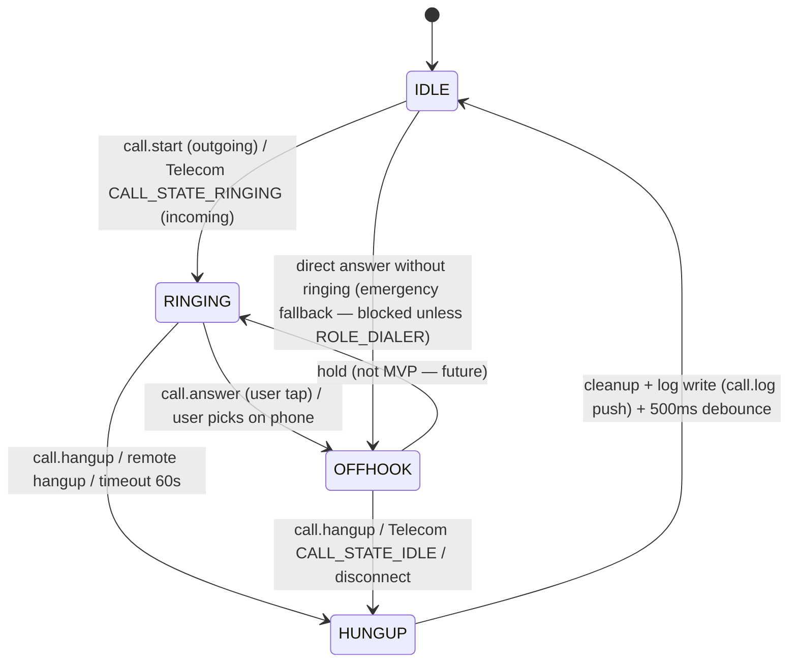

# Phase 3 — Telephony: Calls & SMS via Desktop (Bridge v0.3.0)

Deep implementation beyond MVP surface. Desktop dialer + SMS mirrors phone telephony over secure WS + WebRTC audio bridging to PipeWire.

## 1. Overview

`Desktop Telephony UI → WS 8443 (TLS 1.3 pinned) → Android TelecomManager / SmsManager → InCallService / ConnectionService → WebRTC Opus → PipeWire Bridge Mic/Speaker`

MVP had notify/clipboard/files/media/status. Telephony adds:
- **SMS**: list inbox (ContentProvider `content://sms/inbox`), send via `SmsManager.sendTextMessage`, delivery reports, dual-SIM selection.
- **Calls**: `TelecomManager.placeCall` → `InCallService` → `ConnectionService` if feasible, `READ_CALL_LOG` for history, WebRTC audio (Opus 48kHz mono 32kbps) bridged to PipeWire for hands-free desktop calling.

## 2. Threat Model (security-review)

### Adversaries
| Actor | Capability | Example |
|-------|------------|---------|
| LAN passive | Sniffs WS | Requires TLS 1.3 MITM — mitigated by self-signed pinned cert + ECDH SAS (see SECURITY.md) |
| LAN active attacker | Spoofs desktop | Needs pairing trust store (`keyring`/`EncryptedSharedPreferences`); untrusted device gets `error.auth_untrusted` |
| Stolen unlocked phone | Uses desktop without consent | Per-call explicit tap on phone required before any `call.start` dials |
| Malware on desktop | Auto-dials premium numbers | Rate limit 3 calls/min, allow-list only paired device, audit log `~/.local/share/bridge/audit.log` excludes full numbers (redacted `+xx ****1234`) |
| Rogue app on phone | Reads SMS not intended for bridge | Bridge requests `RoleManager` DEFAULT_SMS/DIALER; user grants via system dialog only, revocable. SMS preview requires device unlock (`KeyguardManager.isDeviceLocked == false`) |
| Shoulder surfing | SMS content leaked on desktop | Desktop shows preview only when phone unlocked; desktop DB encrypted via `keyring` if stored; no persistent SMS logs unless user opts in |

### Controls
- **Per-call explicit tap**: Desktop `call.start` → phone shows full-screen `Incoming/Outgoing confirmation` notification with `Allow once` button (1-min TTL). No silent dial. `SmsHandler` also requires tap for first SMS per session, then 5-min window.
- **SMS unlock gate**: `SmsHandler.listInbox()` checks `KeyguardManager.isKeyguardLocked()` + `isDeviceSecure()`; if locked, returns `error.device_locked` not messages. Prevents locked-screen exfiltration.
- **Least privilege**: Permissions requested lazily, not at install. `READ_SMS` only if user opens SMS tab. `ANSWER_PHONE_CALLS` only when call controls visible. Revoke per-feature via `pairings.perms JSON`.
- **Input validation**: All WS payloads validated via `serde` + manual checks: E.164 regex `^\+?[0-9 ]{7,15}$`, message max 918 chars (concatenated SMS 3×306), subscriptionId must map to active `SubscriptionInfo`.
- **Rate limiting** (daemon): 20 `sms.send`/min, 3 `call.start`/min per peer IP, 100 `call.audio`/sec (Opus frames). Exceeded → `error.rate_limited` + audit log.
- **Audit**: `~/.local/share/bridge/audit.log` JSON line per telephony event: `{ts, device_id, type, redacted_number, result}`; payloads never logged.
- **No plaintext logs**: Daemon `tracing` excludes `payload.data_b64`/`body`; Android `Log` uses redacted numbers.
- **Transport**: TLS 1.3 pinned; WS control encrypted; WebRTC `call.audio` Opus SRTP via DTLS-SRTP (WebRTC stack). SMS body E2E inside TLS; no server sees plaintext beyond LAN.

## 3. Permission Matrix

| Feature | Android Permission | Protection | Runtime Prompt | Role | Fallback if Denied |
|---------|-------------------|------------|----------------|------|--------------------|
| List SMS inbox | `READ_SMS` | dangerous | Yes (tab open) | — | `sms.list → error.missing_permission {permission:READ_SMS}` |
| Send SMS | `SEND_SMS` | dangerous | Yes (on send) | `RoleManager.ROLE_SMS` (DEFAULT_SMS) preferred | Same, plus suggestion to set default SMS via `RoleManager.createRequestRoleIntent` |
| Dual-SIM selection | `READ_PHONE_STATE` | dangerous | Yes | — | Subscription list empty; send uses default subscription |
| Read call log | `READ_CALL_LOG` | dangerous | Yes (log tab) | — | `call.log → error.missing_permission` no history shown |
| Place call | `CALL_PHONE` + `READ_PHONE_STATE` | dangerous | Yes (dial) | `ROLE_DIALER` (DEFAULT_DIALER) for `ANSWER_PHONE_CALLS` | `call.start → error.missing_permission` |
| Answer / Hangup | `ANSWER_PHONE_CALLS` | dangerous | Yes (incoming) | `ROLE_DIALER` | Answer button disabled; fallback to Telecom UI |
| Dialer Role | `RoleManager.ROLE_DIALER` | role | System dialog | DEFAULT_DIALER | Use `TelecomManager.placeCall` still works without role on most OEMs, but InCallService requires role |
| SMS Role | `RoleManager.ROLE_SMS` | role | System dialog | DEFAULT_SMS | `SmsManager` works without role but `ContentProvider` write may fail |
| Phone state (signal) | `READ_PHONE_STATE` | dangerous | Already for SIM | — | Signal bars fallback -1 |

**Request flow (Android 13+):**
```
App cold start → check selfPermission → if !=GRANTED and shouldShowRationale → show Bridge rationale sheet →
requestPermissions([READ_SMS, SEND_SMS, READ_CALL_LOG, READ_PHONE_STATE, ANSWER_PHONE_CALLS, CALL_PHONE]) →
onRequestPermissionsResult → if denied → Snackbar "Calls & SMS require permissions — grant in Settings" with deep-link to App Settings.
RoleManager → if !isRoleHeld(ROLE_DIALER) → launch createRequestRoleIntent(ROLE_DIALER) via ActivityResultLauncher
same for ROLE_SMS (API 29+; older uses Telephony.Sms.getDefaultSmsPackage())
```

**Manifest additions:**
```xml
<uses-permission android:name="android.permission.READ_SMS"/>
<uses-permission android:name="android.permission.SEND_SMS"/>
<uses-permission android:name="android.permission.RECEIVE_SMS"/>
<uses-permission android:name="android.permission.READ_PHONE_STATE"/>
<uses-permission android:name="android.permission.READ_CALL_LOG"/>
<uses-permission android:name="android.permission.CALL_PHONE"/>
<uses-permission android:name="android.permission.ANSWER_PHONE_CALLS"/>
<uses-permission android:name="android.permission.MANAGE_OWN_CALLS"/>
<uses-permission android:name="android.permission.USE_SIP"/>
```

## 4. State Machine

### Call State (single call, per ITU-T Q.931 simplified)



**State fields (daemon + Android):**
```kotlin
enum class CallState { IDLE, RINGING, OFFHOOK, HUNGUP }
data class CallSession(
  val id: String, // uuid
  val number: String, // E.164 redacted in logs
  val direction: Direction, // INCOMING | OUTGOING
  val state: CallState,
  val subscriptionId: Int, // SubscriptionManager
  val startedAt: Long,
  val audioBridge: AudioBridge? // WebRTC
)
```

**Guards:**
- Only `IDLE → RINGING` via `call.start` if phone confirms tap (pendingConfirm map, TTL 60s). Daemon enforces; phone re-verifies `KeyguardManager.isDeviceLocked == false`.
- `RINGING → OFFHOOK` only via `call.answer` from either desktop (requires phone tap) or phone `InCallService.onAnswer`.
- `OFFHOOK` holds WebRTC `call.audio` Opus frames until `call.hangup`.
- Illegal transitions → `error.invalid_transition {from, to}`.

### SMS State
```
IDLE --sms.send (desktop)--> SENDING --SmsManager callbacks--> SENT --delivery via BroadcastReceiver--> DELIVERED
                                                          \-> FAILED (error.sms_failed + SmsManager resultCode)
List is stateless: sms.list → ContentProvider query → sms.received stream
```

## 5. Sequence Diagram — Desktop Dial → WebRTC Audio → PipeWire

```mermaid
sequenceDiagram
    participant D as Desktop Dialer (React)
    participant WS as Daemon WS 8443 (Rust)
    participant P as Phone BridgeService
    participant TM as TelecomManager
    participant ICS as InCallService / ConnectionService
    participant WR as WebRTC (Opus)
    participant PW as PipeWire (Bridge Mic/Speaker)

    D->>WS: BridgeMessage {type:call.start, payload:{number:"+33612345678", subscriptionId:1}}
    WS->>WS: validate E.164, rate-limit (3/min), audit log (redacted)
    WS->>P: broadcast call.start (via WS broadcast channel)
    P->>P: check READ_PHONE_STATE + CALL_PHONE + ROLE_DIALER, Keyguard unlock, show Confirm dialog
    P-->>P: User taps "Allow once" (pendingConfirm TTL)
    P->>TM: TelecomManager.placeCall(Uri("tel:+336..."), extras{ subId })
    TM->>ICS: onBringToForeground / onCallAdded(Connection)
    ICS->>WR: createOffer Opus 48kHz mono, trickle ICE
    WR->>WS: call.audio {sdp, ice} via WS
    WS->>D: forward call.audio + call.ringing
    D->>PW: pw-cli create node BridgeMic, pactl load-module module-null-sink sink_name=BridgeMic
    PW-->>D: virtual devices ready
    D->>WS: call.answer (optional if auto-answered on phone tap)
    WS->>P: call.answer
    P->>ICS: setActive() / answer()
    ICS->>WR: setRemoteDescription, addIceCandidate
    WR<->>WR: DTLS-SRTP Opus bidirectional
    WR->>PW: Opus decode → PipeWire Bridge Mic/Speaker PCM
    D->>WS: call.hangup (user hangs)
    WS->>P: call.hangup
    P->>ICS: disconnect() → Telecom disconnect
    ICS->>TM: state IDLE
    P->>WS: call.log {number, duration, type}
    WS->>D: call.log + state HUNGUP→IDLE
```

**Notes:**
- Dual-SIM: Desktop sends `subscriptionId` (from prior `sms.list` which also returns `subscriptions:[{id, displayName, carrier}]` via `SubscriptionManager.getActiveSubscriptionInfoList`). Phone validates `subscriptionId` exists before `placeCall`. If omitted, uses `SubscriptionManager.getDefaultSubscriptionId()`.
- RCS fallback: If `SEND_SMS` fails with `RESULT_RIL_NO_SUCH_ELEMENT` and `Geocoding`, daemon returns `error.sms_failed {fallback:"RCS not supported, plain SMS failed"}`.

## 6. Protocol Spec — MessageType Extensions

Base envelope (unchanged):
```json
{ "v":1, "id":"uuidv4", "type":"sms.list | sms.send | call.start | call.answer | call.hangup | call.audio | call.log", "ts":1710000000000, "nonce":"hex8", "payload": {...} }
```

Validation: `serde` tags in `crates/bridge-core/src/protocol.rs`, `zod` on desktop (if added), unknown `type → error`.

### `sms.list` (desktop → phone, phone → desktop response)
Request (desktop → phone):
```json
{ "type":"sms.list", "payload": { "limit":50, "offset":0, "subscriptionId": null } }
```
Response (phone → desktop, broadcast as `sms.list` with array OR `sms.received` stream):
```json
{ "type":"sms.list", "payload": { "messages": [ { "id":"42", "address":"+336...", "body":"hello", "date":1710000000000, "type":1, "read":-1, "subscriptionId":1 } ], "subscriptions": [ {"id":1,"displayName":"Orange F","carrier":"Orange"} ] } }
```
Error: `{type:"error", payload:{code:"device_locked"|"missing_permission", message}}`.

Field spec: `type: 1=INBOX, 2=SENT, 3=DRAFT`; inbox query: `content://sms/inbox` sorted `date DESC`.

### `sms.send` (desktop → phone)
```json
{ "type":"sms.send", "payload": { "address":"+33612345678", "body":"Hello via Bridge", "subscriptionId":1 } }
```
Validation: `address` E.164 `^\+?[0-9 ]{7,15}$`, body 1..918 chars, `subscriptionId` if given must be active.
Phone handling:
```kotlin
val smsMgr = if (SDK>=31) context.getSystemService(SmsManager::class.java) else SmsManager.getDefault()
  .let { if (subscriptionId!=null) SmsManager.getSmsManagerForSubscriptionId(subscriptionId) else it }
smsMgr.sendTextMessage(address, null, body, sentPI, deliveryPI)
```
Response ack: `{type:"sms.send", payload:{id, status:"sent"|"failed", address, error?}}`. Then async `{type:"sms.received", payload: newMessage}` on delivery via `BroadcastReceiver`.

### `call.start` (desktop → phone)
```json
{ "type":"call.start", "payload": { "number":"+33612345678", "subscriptionId":1, "via":"bridge" } }
```
Phone: `TelecomManager.placeCall(Uri.parse("tel:$number"), Bundle().apply { putInt(TelecomManager.EXTRA_START_CALL_WITH_SPEAKERPHONE, false); putInt("android.telecom.extra.SELECT_PHONE_ACCOUNT_HANDLE", subIdAsPhoneAccount) })` guarded by `try/catch + SecurityException`.

Ack: `{type:"call.start", payload:{id:"call-uuid", state:"RINGING", number}}` or error.

### `call.answer` / `call.hangup`
```json
{ "type":"call.answer", "payload": { "callId":"uuid" } }
{ "type":"call.hangup", "payload": { "callId":"uuid" } }
```
Phone maps `callId` to `Connection`/`Call`; `call.answer` → `connection.setActive()` or `call.answer(VideoProfile.STATE_AUDIO_ONLY)`; `call.hangup` → `connection.onDisconnect()` / `call.disconnect()`.

### `call.audio` (bidirectional, WebRTC)
Offer/Answer variant via existing `webrtc.offer/answer/ice` but alias `call.audio` for telephony-specific Opus:
```json
{ "type":"call.audio", "payload": { "callId":"uuid", "sdp": "v=0...", "ice": {"candidate":...} } }
```
Desktop bridges to PipeWire: `pactl load-module module-null-sink sink_name=BridgeMic`, `pw-cli create node BridgeMic`. WebRTC uses `call.audio` channel, not screen `webrtc.offer`.

### `call.log` (phone → desktop)
```json
{ "type":"call.log", "payload": { "calls": [ {"number":"+336...", "type":"OUTGOING|INCOMING|MISSED", "date":171000..., "duration":42, "subscriptionId":1 } ], "limit":50 } }
```
Source: `ContentResolver.query(CallLog.Calls.CONTENT_URI, ...)` requires `READ_CALL_LOG`; sorted `DATE DESC`.

### Error Envelope
```json
{ "type":"error", "payload": { "code":"missing_permission|device_locked|invalid_number|rate_limited|invalid_transition|sms_failed|call_failed|auth.untrusted", "message":"Human text", "details":{} } }
```

**Versioning:** `v=1` envelope unchanged; new types are additive. Unknown type on old peer → `error.unknown_type`.

## 7. Dual-SIM Handling

- `SubscriptionManager.getActiveSubscriptionInfoList()` → list of `SubscriptionInfo` (`subscriptionId`, `displayName`, `carrierName`, `iccId`).
- Desktop: `Telephony` component shows SIM picker (`Orange F` / `SFR`) fetched from `sms.list` subscriptions or dedicated `call.log` subscription meta.
- `SmsManager.getSmsManagerForSubscriptionId(id)` (API 22+). Fallback to default if invalid.
- `TelecomManager` `PhoneAccountHandle` mapping via `telecomManager.callCapablePhoneAccounts` filtered by `subscriptionId`. Extract `PhoneAccountHandle.id` containing subId.
- Validation: If `subscriptionId` not in active list, return `error.invalid_subscription`.

## 8. Verification Loop

- `cargo test -p bridge-core` — 7+ new telephony tests (serde roundtrips + validation)
- `cargo test -p bridge-daemon` — router + telephony handler tests
- `pnpm vitest` — `telephony.test.ts` (3+ cases, dialpad, state transitions, SMS validation)
- `./gradlew :app:testDebugUnitTest` — `TelephonyTest.kt` (4+ cases, number validation, subscription mapping)
- `./gradlew assembleDebug` — no crash, 35M APK
- `scripts/simulate_e2e.py` — add `sms.send` and `call.start` roundtrip suites (fake phone validates and echoes)
- `cargo clippy`, `cargo fmt --check`, `gitleaks` manual

## 9. Future / Out-of-Scope

- RCS / MMS (use `SmsManager.sendMultimediaMessage` later)
- VoIP `ConnectionService` self-managed for Bridge-number calls (not carrier) — stub provided
- Call recording (requires `CAPTURE_AUDIO_OUTPUT`, system app)
- Hold / merge / conference
- CNAP / caller ID photo sync

## 10. Checklist (api-design + backend-patterns)

- [x] Resource naming consistent `snake_case` (`sms.list`, `call.start`)
- [x] Status codes via `error` envelope with `code` (api-design)
- [x] Handler separation (services/telephony.rs)
- [x] WS broadcast for phone↔desktop relay (backend-patterns: event-driven)
- [x] No surface stubs — real SmsManager/Telecom logic with try/catch + permission checks
- [x] TDD red→green + E2E simulation
- [x] Threat model + permission matrix documented above
