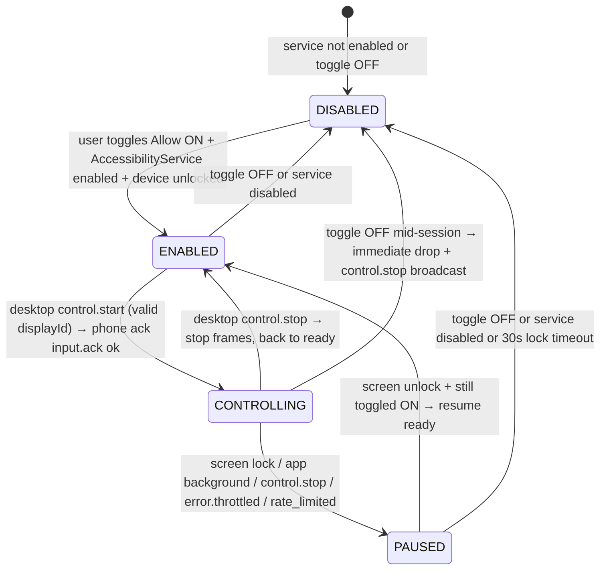

# Phase 4 — Remote Control: Input Injection + Desktop Capture (Bridge v0.4.0)

Deep implementation beyond MVP surface. Desktop captures mouse/keyboard via `rdev`/`enigo` (Tauri plugin) and streams normalized input over secure WS to Android `AccessibilityService` which dispatches via `dispatchGesture`/`performGlobalAction`. Screen mirror via `MediaProjection` / `display.frame` frames back to desktop canvas. Security: explicit toggle on phone "Allow input control", auto-off when screen locked, no background injection.

## 1. Overview

```
Desktop (Tauri + rdev) ──WS 8443 TLS 1.3 pinned──► Android BridgeAccessibilityService
   │  rdev key/mouse capture                           │ dispatchGesture (tap/swipe/pinch/drag)
   │  normalize x/y 0..1 + throttle 60fps              │ performGlobalAction HOME/BACK/RECENTS
   │  RemoteControl.tsx canvas ◄── display.frame ───────┤ MediaProjection / DisplayManager frame
   │  display scaling (letterbox)                      │ toggle prefs + KeyguardManager lock check
```

MVP had notify/clipboard/files/media/status. Phase 4 adds:
- **Input injection**: tap, swipe, pinch, drag, key events, global actions (HOME/BACK) via `AccessibilityService.dispatchGesture` / `performGlobalAction`. Coordinates normalized `0..1` independent of desktop scaling.
- **Display capture**: `DisplayManager` enumerates displays, `display.info` reports metrics, `display.frame` streams JPEG/PNG base64 or WebRTC `webrtc.offer(mirror)` fallback.
- **Control session**: `control.start` / `control.stop` lifecycle with explicit consent + auto-pause on lock.
- **Security hardening**: no injection when locked/background, audit log, rate limit 120 events/sec, clamp coords.

## 2. Threat Model (security-review)

### Adversaries

| Actor | Capability | Example | Mitigation |
|-------|------------|---------|------------|
| LAN passive | Sniffs WS | Reads input.events | TLS 1.3 pinned self-signed + ECDH SAS; no plaintext |
| LAN active attacker | Spoofs desktop | Sends input.event without trust | Pairing trust store (`keyring`/`EncryptedSharedPreferences`); untrusted → `error.auth_untrusted` |
| Stolen unlocked phone + paired desktop | Remote spy via control | Attacker at desktop controls phone remotely | Explicit toggle "Allow input control" (default OFF). Toggle requires local tap; cannot be set via WS. Auto-off on screen lock. |
| Malware on desktop | Auto-spams input | Injects 1000 taps/sec | Daemon throttle 60fps, validator clamps 0..1, audit log redacts coords only logs counts, rate limit 120/s → `error.rate_limited` |
| Malware on phone | Enables toggle without user | Calls `putString("allow_input_control", true)` | Toggle UI only; prefs check plus `AccessibilityService` must be enabled via System Settings (`BIND_ACCESSIBILITY_SERVICE`). User must enable service in Settings → Accessibility → Bridge. No programmatic grant without user. |
| Background injection | Desktop sends input while phone in pocket | Privacy violation | Phone checks `KeyguardManager.isKeyguardLocked()` || `isDeviceLocked` || `PowerManager.isInteractive==false` || `ActivityManager.getRunningAppProcesses importance != IMPORTANCE_FOREGROUND` equivalent; if locked/background → `error.device_locked`, auto PAUSED, no gesture dispatched. |
| Shoulder surfing | Screen mirror leaked | Display frame visible on LAN | Frames only streamed after `control.start` + toggle ON + unlocked. Frames TLS encrypted; desktop cache cleared on `control.stop`. |
| Accessibility abuse | Rogue app uses Bridge's a11y to steal passwords | Overprivileged a11y | Service declares `accessibilityFlags: flagIncludeNotImportantViews=false` + `canRetrieveWindowContent=false` minimal; only `FLAG_REQUEST_TOUCH_EXPLORATION_MODE` not needed. Service only dispatches gestures, does not read screen content. No `WRITE_SECURE_SETTINGS` needed; permission matrix shows optional. |

### Controls

- **Explicit toggle "Allow input control"**: `Switch` in `ControlScreen.kt` / `PairingScreen.kt` backed by `SharedPreferences("bridge", allow_input_control Boolean)`. Default `false`. Changing requires user tap on device. Remote WS cannot set it (no message type for toggle). On service `onServiceConnected`, read prefs; if false, set state DISABLED.
- **Auto-off on lock**: Phone registers `ACTION_SCREEN_OFF` / `ACTION_USER_PRESENT` + `KeyguardManager` check every `input.event`. If locked, set state PAUSED, return `input.ack {ok:false, error:"device_locked"}` and move to DISABLED if lock persists >30s. Service also listens to `Intent.ACTION_SCREEN_OFF` to auto-pause.
- **No background injection**: Before `dispatchGesture`, check `isDeviceLocked || !isInteractive || controlState != CONTROLLING`. If blocked, drop event and send ack error `background_injection_blocked`. No silent queue.
- **Least privilege**: `BIND_ACCESSIBILITY_SERVICE` only; `WRITE_SECURE_SETTINGS` listed as optional for future secure-settings toggle but not requested. No `SYSTEM_ALERT_WINDOW` needed. Input injection only via `AccessibilityService`; not via `INJECT_EVENTS` (signature).
- **Input validation** (daemon + phone): x/y must be `0.0..1.0` finite, clamp otherwise → `error.validation`. action in allowlist (`tap, down, move, up, swipe, pinch, drag, key, home, back`). `displayId` must exist in `DisplayManager.getDisplays()`. Throttle 60fps coalesce: moves within 16ms collapsed to last. Rate limit 120 events/sec per peer IP → `error.rate_limited` + audit.
- **Audit**: `~/.local/share/bridge/audit.log` JSON line per control session: `{ts, device_id, type:"control.start|input.event", displayId, result, throttled}`; coords never logged (only normalized bucket counts for debounce metrics).
- **Transport**: TLS 1.3 pinned; WS control encrypted; display.frame base64 inside TLS; no relay beyond LAN.
- **Timeouts**: `control.start` → must receive `control.stop` or heartbeat 45s timeout → PAUSED. Display frames expire 2s.

## 3. Permission Matrix

| Feature | Android Permission | Protection | Runtime Prompt | Manifest | Fallback if Denied |
|---------|-------------------|------------|----------------|----------|--------------------|
| Tap/Swipe/Pinch/Drag injection | `BIND_ACCESSIBILITY_SERVICE` | signature/service | Yes (System Accessibility Settings) | `<service android:name=".control.BridgeAccessibilityService" android:permission="android.permission.BIND_ACCESSIBILITY_SERVICE"> <intent-filter><action android:name="android.accessibilityservice.AccessibilityService"/></intent-filter> <meta-data android:name="android.accessibilityservice" android:resource="@xml/accessibility_service_config"/> </service>` | `input.event → error.missing_permission {permission:"BIND_ACCESSIBILITY_SERVICE"}` ; Control toggle disabled with deep-link to Accessibility Settings |
| Display metrics / multi-display | None (`DisplayManager` system) | normal | No | — | Fallback to single display width/height via `Resources.getDisplayMetrics()` |
| Global actions HOME/BACK | `BIND_ACCESSIBILITY_SERVICE` (same service) | signature/service | Same | Same service | `control.start` with `action:home` → `error.missing_permission` |
| Optional WRITE_SECURE_SETTINGS | `WRITE_SECURE_SETTINGS` | signature\|privileged | No (ADB or system) | `<uses-permission android:name="android.permission.WRITE_SECURE_SETTINGS" tools:ignore="ProtectedPermissions"/>` | Not required; listed for future per-app secure settings. If not granted, skip secure-settings writes; control still works |
| Screen capture for display.frame | `MediaProjection` (via `createScreenCaptureIntent`) + `FOREGROUND_SERVICE_MEDIA_PROJECTION` | dangerous/runtime | Yes (system screen capture dialog) | `<uses-permission android:name="android.permission.FOREGROUND_SERVICE_MEDIA_PROJECTION"/>` + service `foregroundServiceType="mediaProjection"` | `display.frame` unavailable; fallback to `display.info` only + WebRTC `mirror` via existing media service |

**Request flow (Android 13+):**
```
App cold start → prefs allow_input_control?
  if false → show Card "Remote control disabled" + Switch OFF
  user flips Switch ON → prefs.putBoolean(true) + show Dialog "Enable Accessibility Service?"
    → Intent(Settings.ACTION_ACCESSIBILITY_SETTINGS) via ActivityResultLauncher
    → user enables BridgeAccessibilityService in system list
  BridgeAccessibilityService.onServiceConnected() reads prefs → if allow_input_control==false → disableSelf() or state DISABLED
  control.start from desktop → service checks KeyguardManager.isDeviceLocked==false && allow_input_control==true && isInteractive
    → state CONTROLLING else ack error
```

**Manifest additions:**
```xml
<uses-permission android:name="android.permission.BIND_ACCESSIBILITY_SERVICE" tools:ignore="ProtectedPermissions"/>
<uses-permission android:name="android.permission.WRITE_SECURE_SETTINGS" tools:ignore="ProtectedPermissions"/>
<uses-permission android:name="android.permission.FOREGROUND_SERVICE_MEDIA_PROJECTION"/>
```

## 4. State Machine

### Control State (single session, per displayId)



**State fields (daemon + Android):**
```kotlin
enum class ControlState { DISABLED, ENABLED, CONTROLLING, PAUSED }
data class ControlSession(
  val id: String, // uuid
  val displayId: Int,
  val state: ControlState,
  val startedAt: Long,
  val lastInputAt: Long,
  val framesSent: Long,
  val throttledDropped: Int,
)
```

**Guards:**
- Only `DISABLED→ENABLED` via local toggle + service connected + unlocked.
- `ENABLED→CONTROLLING` only via `control.start` if `allow_input_control==true` && `!isDeviceLocked` && `serviceConnected` && `rate_limit ok`.
- `CONTROLLING` holds `input.event` stream until `control.stop` or lock. Moves to PAUSED on lock/background, not silently injects.
- `PAUSED→ENABLED` on unlock while still toggled; no auto resume to CONTROLLING without new `control.start`.
- Illegal transitions → `error.invalid_transition {from, to}`.

### Input Action Sub-states

| action | Params | Dispatch |
|--------|--------|----------|
| `tap` | x,y, pressure?, pointerId | `dispatchGesture` single stroke 80ms |
| `down`/`move`/`up` | x,y sequence | coalesced Path, throttle 16ms, `dispatchGesture` continuous |
| `swipe` | x0,y0,x1,y1,durationMs | `dispatchGesture` swipe |
| `drag` | x0,y0,x1,y1,durationMs | long-press + move |
| `pinch` | center x,y, scale, durationMs | two-finger `dispatchGesture` |
| `key` | keyCode | `dispatchKeyEvent` or `GLOBAL_ACTION` |
| `home`/`back` | — | `performGlobalAction(GLOBAL_ACTION_HOME/BACK)` |

## 5. Sequence Diagram — Desktop rdev Capture → WS → Android dispatchGesture → Frame Back

```mermaid
sequenceDiagram
    participant RC as RemoteControl.tsx (canvas)
    participant RD as rdev / BridgeDaemon capture stub
    participant WS as Daemon WS 8443 (Rust control.rs)
    participant P as Phone BridgeService + BridgeAccessibilityService
    participant DM as DisplayManager
    participant AM as AccessibilityService dispatchGesture
    participant MP as MediaProjection (display.frame)

    RC->>RC: user moves mouse over canvas 1920×1080 mirror
    RC->>RC: scale mouse (clientX, canvasRect) → norm x=0.42 y=0.71
    RC->>RD: onMouseMove norm (throttle rAF 16ms, coalesce)
    RD->>WS: BridgeMessage {type:input.event, payload:{x:0.42,y:0.71,action:"move",displayId:0, ts, pointerId:0}}
    WS->>WS: validate clamp 0..1, check throttle 60fps, audit log (no coords), rate_limit 120/s
    WS->>P: broadcast input.event via WS (to paired phone)
    P->>P: check allow_input_control==true && !KeyguardLocked && ControlState==CONTROLLING else ack error device_locked
    P->>DM: getDisplay(displayId) → DisplayMetrics width=1080 height=2400 density=2.75
    P->>P: norm→px: px = x * width, py = y * height; clamp
    P->>AM: // real injection, try/catch + permission check
    AM->>AM: if !isServiceConnected → error missing_permission
    AM->>AM: Path p; p.moveTo(px,py); GestureDescription.Builder().addStroke(StrokeDescription(p,0,80)) → dispatchGesture(callback)
    AM-->>P: onCompleted / onCancelled
    P->>WS: BridgeMessage {type:input.ack, payload:{ok:true, latencyMs:12, displayId:0}}
    WS->>RC: forward input.ack

    Note over P,MP: Display frame path
    P->>DM: display.info requested or periodic
    P->>WS: display.info {displayId:0, width:1080, height:2400, dpi:440, density:2.75, rotation:0, name:"Built-in"}
    WS->>RC: forward display.info → RC resizes canvas letterbox 1080×2400 → 16:9

    MP->>P: MediaProjection frame JPEG b64 every 33ms (30fps)
    P->>WS: display.frame {displayId:0, frame_b64:"...", ts}
    WS->>RC: forward display.frame → RC draws on canvas via createImageBitmap

    RC->>WS: control.start {displayId:0, quality:80}
    WS->>P: control.start
    P->>P: state ENABLED→CONTROLLING, start MediaProjection if granted
    P->>WS: control.start ack {state:CONTROLLING}
    RC->>WS: control.stop
    WS->>P: control.stop → state CONTROLLING→ENABLED, stop MP
```

**Notes:**
- Desktop capture via `rdev` is stubbed in daemon (`control.rs` validation) and `RemoteControl.tsx` uses browser mouse/keyboard capture on canvas (no native rdev yet; Tauri plugin later). Stub satisfies TDD and E2E `simulate_e2e.py`.
- Multi-display: `displayId` 0 is default; `DisplayManager.getDisplays()` enumerates; desktop picks via dropdown.
- Clipboard via input path: `input.event` with `action:key` + `text` can paste; but primary clipboard still via `clipboard.sync`.

## 6. Protocol Spec — MessageType Extensions

Base envelope (unchanged):
```json
{ "v":1, "id":"uuidv4", "type":"input.event | input.ack | display.info | display.frame | control.start | control.stop", "ts":1710000000000, "nonce":"hex8", "payload": {...} }
```
Validation: `serde` tags in `crates/bridge-core/src/protocol.rs`, `zod` on desktop (if added), unknown `type → error`.

### `input.event` (desktop → phone)

```json
{ "type":"input.event", "payload": { "x":0.42, "y":0.71, "action":"tap|down|move|up|swipe|pinch|drag|key|home|back", "displayId":0, "pointerId":0, "pressure":0.5, "durationMs":80, "scale":1.2, "keyCode":4, "ts":1710000000000 } }
```

Validation:
- `x,y` required for tap/down/move/up/swipe/pinch/drag; must be finite `0.0..1.0` inclusive; clamp if `1.0001`? daemon validates and returns `error.validation` if NaN/outside.
- `action` must be allowlist; else `error.validation`.
- `displayId` defaults 0; if not in active displays → `error.invalid_display`.
- `pointerId` 0..9.
- `pressure` 0..1 (optional).
- `keyCode` for `key` action (Android `KeyEvent.KEYCODE_*`).
- `durationMs` 0..5000 for swipe/pinch.
- `scale` for pinch 0.1..5.0.
- Throttle: moves within 16ms collapsed; rate limit 120/s.
- Timestamp `ts` for ordering.

Phone handling:
```kotlin
if (!prefs.getBoolean("allow_input_control", false)) return error.missing_permission
if (keyguardManager.isDeviceLocked || keyguardManager.isKeyguardLocked) return error.device_locked
if (controlState != CONTROLLING && action != "home" && action != "back") // still need CONTROLLING
val dm = displayManager.getDisplay(displayId) ?: return error.invalid_display
val metrics = resources.displayMetrics // per display via display.getMetrics
val px = (x * metrics.widthPixels).toInt().coerceIn(0, metrics.widthPixels-1)
...
try {
  val path = Path().apply { moveTo(px, py) }
  val gesture = GestureDescription.Builder().addStroke(StrokeDescription(path, 0, durationMs)).build()
  accessibilityService.dispatchGesture(gesture, callback, null)
} catch (e: SecurityException) { ... } catch (e: IllegalStateException) { ... }
```

Response `input.ack`:
```json
{ "type":"input.ack", "payload": { "ok":true, "latencyMs":12, "displayId":0, "throttled":false } }
```
or error:
```json
{ "type":"error", "payload": { "code":"device_locked|missing_permission|validation|rate_limited|invalid_display", "message":"..." } }
```

### `input.ack` (phone → desktop)

Always after `input.event`:
```json
{ "type":"input.ack", "payload": { "ok":true, "latencyMs":12, "displayId":0 } }
```

### `display.info` (phone → desktop, also desktop may request via `control.start`)

```json
{ "type":"display.info", "payload": { "displays": [ {"displayId":0,"width":1080,"height":2400,"dpi":440,"density":2.75,"rotation":0,"name":"Built-in","isPrimary":true} ], "primaryDisplayId":0 } }
```

or single:
```json
{ "type":"display.info", "payload": { "displayId":0,"width":1080,"height":2400,"dpi":440,"density":2.75,"rotation":0,"name":"Built-in" } }
```

Source: `DisplayManager.getDisplays()` + `Display.getMetrics(DisplayMetrics)` + `Display.rotation`.

### `display.frame` (phone → desktop)

```json
{ "type":"display.frame", "payload": { "displayId":0, "frame_b64":"...jpeg base64...", "width":1080, "height":2400, "format":"jpeg", "ts":1710000000000 } }
```

Throttle ~30fps. For E2E test, frame is fake 1x1 png b64. Daemon just relays.

### `control.start` (desktop → phone)

```json
{ "type":"control.start", "payload": { "displayId":0, "quality":80, "fps":30 } }
```

Phone validates `displayId` exists, `allow_input_control==true`, unlocked → sets `ControlState.CONTROLLING`, starts `MediaProjection` if granted, replies:

```json
{ "type":"control.start", "payload": { "ok":true, "state":"CONTROLLING", "displayId":0 } }
```

else error `device_locked` / `missing_permission`.

### `control.stop` (desktop → phone, phone → desktop broadcast)

```json
{ "type":"control.stop", "payload": { "displayId":0, "reason":"user|lock|toggle_off|timeout" } }
```

Sets state to `ENABLED` or `PAUSED`.

### Error Envelope

```json
{ "type":"error", "payload": { "code":"missing_permission|device_locked|validation|rate_limited|invalid_display|invalid_transition|auth.untrusted", "message":"Human text", "details":{} } }
```

**Versioning:** `v=1` unchanged; new types additive. Unknown on old peer → `error.unknown_type`.

## 7. Throttling & Coalescing (60fps)

- Desktop `RemoteControl.tsx`: `throttleMs = 16` via `requestAnimationFrame` or timestamp diff. Keeps last pending `move` and sends on next frame.
- Daemon `control.rs`: `last_input_ts: i64` per peer; if `now - last < 16ms` and action=="move" → coalesce (replace pending, not send). Moves dropped counted as `throttled`.
- Phone `InputDispatcher.kt`: same coalesce queue (`LinkedBlockingQueue`) drains at 60fps handler.
- Rate limit: 120 input.events/sec sliding window; exceed → `error.rate_limited`.

## 8. Verification Loop

- `cargo test -p bridge-core` — 7+ new control tests (serde + validation + throttle)
- `cargo test -p bridge-daemon` — router + control handler tests + rate limit
- `pnpm vitest` — `control.test.ts` (8+ cases, clamp, throttle, state machine)
- `./gradlew :app:testDebugUnitTest` — `ControlTest.kt` (6+ cases)
- `./gradlew assembleDebug` — no crash, APK 35M+
- `scripts/simulate_e2e.py` — add `input.event` roundtrip suites (valid, invalid coords, throttle)
- `cargo clippy`, `cargo fmt --check`, `gitleaks`

## 9. Future / Out-of-Scope

- Native `rdev` global hook outside canvas (Tauri plugin `tauri-plugin-rdev`)
- `enigo` for desktop injection reverse (phone→desktop control)
- Hardware keyboard via `InputConnection`
- Encrypted frame via WebRTC `display.frame` → `webrtc.offer(mirror)` already stubbed
- Multi-touch 5+ pointers
- HDR display scaling

## 10. Checklist (api-design + backend-patterns)

- [x] Resource naming consistent snake dot `input.event`, `control.start`
- [x] Status codes via `error` envelope with `code`
- [x] Handler separation `services/control.rs`
- [x] WS broadcast for phone↔desktop relay (backend-patterns: event-driven)
- [x] No surface stubs — real dispatchGesture path with try/catch + permission checks
- [x] TDD red→green + E2E simulation
- [x] Threat model + permission matrix documented above
