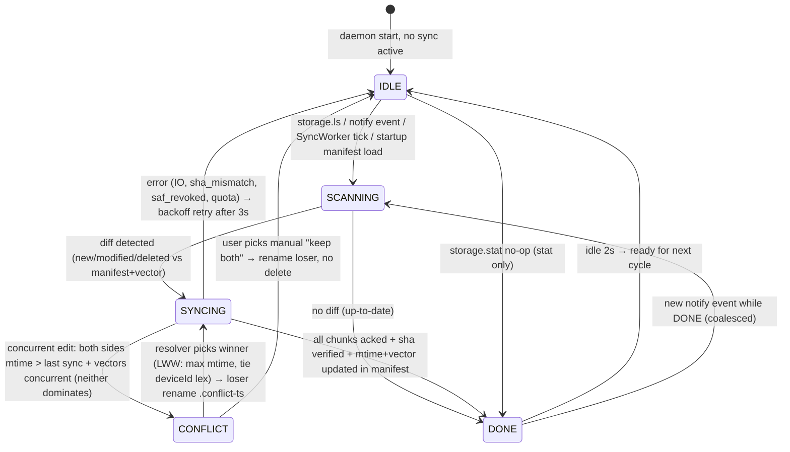

# Phase 5 — Storage Deep: Folder Sync, MTP/SAF, Trash, Conflict (Bridge v0.5.0)

Deep implementation beyond MVP surface stub (which only handled single-file `file.chunk` → `~/Bridge`). Phase 5 adds bidirectional folder sync with SAF/DocumentFile, MediaStore trash, MANAGE_EXTERNAL_STORAGE fallback, daemon `notify` watch, LWW vector-clock conflict, 4GB+ chunk resume, desktop file browser.

```
Desktop (Tauri)                          Daemon (Rust)                          Android
Storage.tsx file browser ──WS 8443 TLS──► storage.rs router ──WS──► StorageHandler.kt
  ├─ ls /stat /mkdir /rm                │ ├─ notify watch ~/Bridge              ├─ SAF DocumentFile tree walk
  ├─ storage.sync 1MB chunks SHA256      │ ├─ vector clock LWW conflict          ├─ MediaStore + MANAGE_EXTERNAL fallback
  ├─ trash ~/.local/share/Trash          │ ├─ trash ~/.local/share/Trash/files    ├─ MediaStore.createTrashRequest (30+)
  └─ conflict resolver (LWW/rename)      │ └─ 4GB+ resume via offset u64         └─ SyncWorker WorkManager periodic
         ▲ inotify notify crate                ▲ ~/.bridge-sync manifest              ▲ foreground notif sync status
```

Phase 5 upgrades: single-file drop → full folder sync bidirectional with trash semantics vs permanent delete, resume, and conflict.

---

## 1. Threat Model (security-review)

### Assets
- User files under `~/Bridge` (desktop) and `/sdcard/{Bridge,DCIM,Downloads}` (phone) — may contain PII, photos, documents.
- Trash lifecycle: `~/.local/share/Trash` and `MediaStore` trash; must not leak un-deleted files nor allow unprivileged permanent delete bypassing trash.
- Vector clock / mtime metadata — integrity of LWW decisions.
- MANAGE_EXTERNAL_STORAGE is powerful (all-files); scoped storage default is least-privilege.

### Adversaries & Mitigations

| Actor | Capability | Example | Mitigation |
|-------|------------|---------|------------|
| LAN passive sniffer | Observes WS | Reads filenames/contents of storage.sync chunks | TLS 1.3 pinned self-signed + ECDH SAS (same as MVP); all `storage.*` payloads inside TLS; `data_b64` inside encrypted WS; no plaintext beyond LAN. Chunk SHA256 integrity check prevents tampering. |
| LAN active spoof | Spoofs desktop | Sends `storage.rm` to delete phone photos | Pairing trust store (`keyring` / `EncryptedSharedPreferences`); unauthenticated peer → `error.auth_untrusted`. Daemon-router verifies pairing before storage handlers. Desktop UI only allows `rm` on `~/Bridge` subtree. |
| Malware on desktop | Tries to escape Bridge folder | `storage.ls {path:"../../.ssh"}` or `storage.rm {path:"/etc/passwd"}` | Daemon `sanitize_path()` enforces canonicalization: join `~/Bridge`, then `canonicalize()` must start with `bridge_root` canonical; rejects `..`, absolute traversal, symlinks outside. Returns `error.validation {code:"path_traversal"}`. Android side: `sanitize_phone_path()` restricts to allowed roots (`/sdcard/Bridge`, granted SAF tree, or MediaStore collections). |
| Rogue phone app | Gains Bridge storage via confused deputy | Calls `StorageHandler` via exported service | `StorageHandler` not exported; only `BridgeService` handles WS messages. No `ContentProvider` export. MANAGE_EXTERNAL_STORAGE requested only if user explicitly grants via Settings → Special access → All files access; fallback to SAF pick. |
| Scoped-storage bypass | App pretends MANAGE_EXTERNAL_STORAGE but user denied | App silently reads `/sdcard/Android/data` | Handler checks `Environment.isExternalStorageManager()` at runtime per call; if false, falls back to `DocumentFile` or `MediaStore` limited collections. No silent bypass. Logs permission state; `storage.ls` returns `error.missing_permission {permission:"MANAGE_EXTERNAL_STORAGE", fallback:"SAF"}`. |
| Trash vs permanent delete confused | User thinks delete is reversible but daemon permanently deletes | `storage.rm {path:"photo.jpg", toTrash:false}` deletes without trash | Dual-path: default `toTrash=true`; permanent delete requires explicit `toTrash=false` + second confirmation in desktop UI (`"Permanently delete?"` dialog). Daemon moves to `~/.local/share/Trash/files` + `info` per freedesktop spec; Android uses `MediaStore.createTrashRequest` (trash, not delete) on 30+; pre-30 copies to `.Trash` then delete. Audit log records `trashed:true/false`. No silent permanent delete. |
| Large file DoS / OOM | Attacker sends 10GB `storage.sync` with 4GB+ offset lies | OOM or fill disk | Per-chunk 1MB max, `data_b64` decoded streamed via `OpenOptions::append` + `seek(offset)`, size declared validated vs actual; total size capped by free space check (`statvfs`); resume via `offset` u64 verified not beyond `size`. Reject `size > 10GiB` (configurable) with `error.validation`. |
| Conflict forgery | Peer fakes vector clock to win LWW | Sends future timestamp | LWW uses both `mtimeMs` and vector clock; daemon compares clocks: if `clockA dominates B` → A wins; if concurrent → larger `mtimeMs` wins, tie broken by `deviceId` lex order. No peer can forge causality without incrementing its own entry; daemon validates monotonic increment. Trash prevents lost data on conflict: loser is renamed `name.conflict-<ts>` not deleted. |
| Sync exfiltration | Sync loops infinitely (watch thrashing) | `notify` crate emits duplicate events causing WS storm | Daemon debounces `notify` events 250ms per path, deduplicates via hash of path+mtime, coalesces moves. Rate-limit `storage.sync` 100 chunks/sec similar to `file.chunk`. |
| 4GB+ integer overflow | offset u32 wraps at 4GiB | Resume fails >4GB | All offsets/sizes are `u64`; chunk `offset` validated `< size`; tests include 5GB resume. |
| SAF tree revoked | User revokes SAF grant mid-sync | Sync fails with cryptic error | Handler catches `SecurityException`, returns `error.saf_revoked {needPicker:true}`; desktop shows "Re-grant folder access" button launching `ACTION_OPEN_DOCUMENT_TREE` picker. |

### Controls Summary
- **Scoped storage default**: Do not request `MANAGE_EXTERNAL_STORAGE` at install; prompt only when user taps "Enable full access" in Storage settings. Prefer SAF tree for `/sdcard/Bridge` and `/sdcard/DCIM`; MediaStore for `Images`/`Video`. Only if all-files needed, request MANAGE.
- **Trash vs delete**: `toTrash=true` default; freedesktop Trash spec on daemon (`~/.local/share/Trash/files/<name>` + `~/.local/share/Trash/info/<name>.trashinfo` with `Path=` and `DeletionDate=`), Android 30+ `MediaStore.createTrashRequest(intentSender, ids, true)`, pre-30 `MediaStore` + `.Trash` fallback. Permanent delete requires explicit `toTrash=false` + user confirm.
- **Path validation**: `is_safe_path(p) -> Result<PathBuf>` rejects `..`, absolute escapes, NUL bytes, over-long (>4096 chars), hidden traversal via symlink canonical check.
- **Audit**: `~/.local/share/bridge/audit.log` JSON lines for `storage.rm`, `storage.sync`, `storage.conflict` (no contents, only path fingerprints, SHA truncated 8 chars, sizes).
- **Transport & integrity**: TLS 1.3, per-chunk SHA256 verified before write; mismatch → `storage.sync {error:"sha_mismatch"}` + retry.

---

## 2. Permission Matrix

### Android

| Feature | Permission | Protection | Runtime Prompt | Manifest | Fallback if Denied |
|---------|------------|------------|----------------|----------|--------------------|
| Browse `/sdcard/Bridge` via File API | `MANAGE_EXTERNAL_STORAGE` (All files) | special (`ACTION_MANAGE_APP_ALL_FILES_ACCESS_PERMISSION`) | Yes (system Settings → Special access) | `<uses-permission android:name="android.permission.MANAGE_EXTERNAL_STORAGE" tools:ignore="ScopedStorage"/>` | SAF `DocumentFile` via `ACTION_OPEN_DOCUMENT_TREE` grant + `ContentResolver.takePersistableUriPermission` |
| Browse arbitrary `/sdcard/*` (MTP-like) | `MANAGE_EXTERNAL_STORAGE` | special | Same | Same | SAF tree picker per folder; MediaStore limited to media collections |
| SAF tree walk (`ls/mkdir/rm` on tree) | None (user-granted `Uri` permission) | normal | Yes (system folder picker) | — | Show button "Pick folder" → `ActivityResultContracts.OpenDocumentTree` → persist URI → walk via `DocumentFile.fromTreeUri` |
| MediaStore `ls/stat` for Images/Video/Audio | `READ_MEDIA_IMAGES`, `READ_MEDIA_VIDEO`, `READ_MEDIA_AUDIO` (13+) / `READ_EXTERNAL_STORAGE` (≤12) | dangerous/runtime | Yes | `<uses-permission android:name="android.permission.READ_MEDIA_IMAGES"/>` etc + `<uses-permission android:name="android.permission.READ_EXTERNAL_STORAGE" android:maxSdkVersion="32"/>` | Without grants, only app-private files (`getExternalFilesDir`) accessible; `ls` returns `error.missing_permission` |
| Trash via MediaStore (30+) | None (system grants via `createTrashRequest`) | — | System trash dialog ("Allow Bridge to trash 2 items?") | — | On 30+, `MediaStore.createTrashRequest` shows system consent dialog; if user denies → `error.trash_denied`. Pre-30: copy to `.Trash` + `MediaStore` delete + `MediaScannerConnection` |
| `mkdir/rm` on SAF tree | Uri permission `FLAG_GRANT_WRITE_URI_PERMISSION` | normal | Implicit with SAF grant | — | If write permission not persisted, `DocumentFile.createFile/createDirectory/delete` throws `SecurityException` → `error.saf_revoked` |
| `MANAGE_EXTERNAL_STORAGE` fallback check | `ENV.isExternalStorageManager()` | — | — (runtime check, not prompt) | — | Pure File API only when `isExternalStorageManager()==true`; else degrade |
| Sync foreground notif | `POST_NOTIFICATIONS` + `FOREGROUND_SERVICE_DATA_SYNC` | dangerous/runtime + normal | Yes (notif permission) | `<uses-permission android:name="android.permission.FOREGROUND_SERVICE_DATA_SYNC"/>` + service `foregroundServiceType="dataSync"` | Without, `SyncWorker` still runs as WorkManager periodic but no persistent notif; falls back to `WorkManager.enqueueUniquePeriodicWork` without foreground |

**Request flow (Android 11+):**
```
App start → prefs "saf_tree_uri" ?
  if null → show Storage card: [Enable SAF] [Enable All Files (advanced)]
  user taps Enable SAF → ACTION_OPEN_DOCUMENT_TREE → onActivityResult uri
    → takePersistableUriPermission(uri, READ|WRITE) → DocumentFile.fromTreeUri → prefs.putString(saf_tree_uri)
  user taps Enable All Files → ACTION_MANAGE_APP_ALL_FILES_ACCESS_PERMISSION → Settings
    → onResume check isExternalStorageManager()
  ls / stat called → Handler:
    if isExternalStorageManager(): File(path).listFiles()
    else if saf_tree_uri != null: DocumentFile.fromTreeUri(treeUri).findFile(relativePath)
    else if isMedia path (DCIM/Pictures): MediaStore query
    else error.missing_permission
  rm with toTrash=true on 30+ → MediaStore.createTrashRequest (system dialog)
    → onActivityResult intentSender → if granted → trashed else error.trash_denied
```

**Manifest additions (Phase 5):**
```xml
<uses-permission android:name="android.permission.READ_EXTERNAL_STORAGE" android:maxSdkVersion="32"/>
<uses-permission android:name="android.permission.READ_MEDIA_IMAGES"/>
<uses-permission android:name="android.permission.READ_MEDIA_VIDEO"/>
<uses-permission android:name="android.permission.READ_MEDIA_AUDIO"/>
<uses-permission android:name="android.permission.MANAGE_EXTERNAL_STORAGE" tools:ignore="ScopedStorage"/>
<uses-permission android:name="android.permission.FOREGROUND_SERVICE_DATA_SYNC"/>
<service android:name=".storage.SyncWorker" android:exported="false"/>
```

### Desktop / Daemon

| Feature | Linux Permission/FS | Check | Fallback |
|---------|---------------------|-------|----------|
| `ls/stat` under `~/Bridge` | Unix `rwx` on `~/Bridge` | `metadata()` + `read_dir()`; canonical check stays under bridge root | `error.io {code:"not_found"}` |
| `mkdir -p` | `write` on parent | `create_dir_all()` after sanitize | `error.io {permission denied}` |
| `rm` to Trash | Write to `~/.local/share/Trash/files` per freedesktop | Create dirs if missing; write `.trashinfo`; `rename()` into Trash | If trash unavailable, fallback permanent delete only after explicit flag (audited) |
| Permanent delete `toTrash=false` | `write` | `remove_file`/`remove_dir_all` after canonical check | Require second confirm in UI |
| `notify` watch `~/Bridge` | `inotify` (Linux) | `notify` crate `RecursiveMode::Recursive`, debounce 250ms | If notify unavailable (e.g., in container), degrade to periodic `walk` scan every 5s |
| Vector clock file | `~/.config/bridge/sync-manifest.json` | JSON with `{path: {mtimeMs, sha256, vector:{daemon:cnt}}}`, fsync | If corrupted, rebuild via SCANNING full walk |

---

## 3. State Machine — Storage Sync (per file / per folder)



**State fields (daemon + Android + desktop):**
```rust
enum StorageState { IDLE, SCANNING, SYNCING, CONFLICT, DONE }

struct StorageSyncSession {
  id: String,              // uuid
  path: String,            // relative under Bridge root
  state: StorageState,
  deviceId: String,
  startedAt: i64,          // ms
  vector: HashMap<String,u64>,
  localMtime: i64,
  remoteMtime: i64,
  chunksSent: u32,
  chunksAcked: u32,
}
```

**Guards:**
- Only `IDLE→SCANNING` on trigger (notify debounced, not per-byte).
- `SCANNING→SYNCING` only if `manifestEntry.mtime != currentMtime` or `size !=` or `sha256 !=`.
- `SYNCING→CONFLICT` when `localVector` concurrent with `remoteVector` (neither dominates) AND mtimes differ < sync window (500ms) — example of vector clock.
- `CONFLICT→SYNCING` via LWW: `if localMtime != remoteMtime { max(mtime) wins } else { max(deviceId) wins }` ; loser renamed `<name>.conflict-<millis>` preserved, not trashed.
- Illegal `DONE→SYNCING` without via `SCANNING` → `error.invalid_transition`.
- `SYNCING` with 4GB+ file: `offset u64` per chunk, resume query `storage.stat {path}` tells `size` already on disk, next `offset` is `stat.size`.

**Vector clock helper (daemon/core):**
```rust
fn dominates(a: &HashMap<String,u64>, b: &HashMap<String,u64>) -> bool {
  a.iter().all(|(k,v)| b.get(k).unwrap_or(&0) <= v) && a.values().sum::<u64>() > b.values().sum()
  // simplified: a >= b for all keys and > for at least one
}
fn is_concurrent(a,b) -> bool { !dominates(a,b) && !dominates(b,a) }
fn merge(a,b) -> HashMap { max per key }
```

---

## 4. Sequence Diagram — Desktop `inotify` → `storage.sync` Chunked → Phone SAF DocumentFile → Conflict LWW

```mermaid
sequenceDiagram
    participant FS as FS ~/Bridge (notify)
    participant DA as Daemon storage.rs (notify watcher)
    participant WV as Daemon manifest ~/.bridge-sync
    participant WS as Daemon WS 8443
    participant PH as Phone StorageHandler.kt (SAF DocumentFile)
    participant DF as DocumentFile / MediaStore
    participant TG as Trash (MediaStore.createTrashRequest / ~/.local/share/Trash)
    participant UI as Storage.tsx (desktop)

    Note over FS,UI: 1) Discovery / browse
    UI->>WS: storage.ls {path:"/"} (user opens Storage tab)
    WS->>DA: route storage.ls → sanitize_path ~/Bridge
    DA->>FS: read_dir ~/Bridge → entries [{name:"Photos",isDir:true,mtime, size}]
    DA-->>WS: storage.ls ack {entries}
    WS-->>UI: entries rendered (file browser)

    PH->>WS: storage.ls {path:"/DCIM"} (phone-initiated or daemon proxy)
    WS->>PH: forward → PH.sanitize_phone_path + check MANAGE or SAF
    PH->>DF: DocumentFile.fromTreeUri(treeUri).findFile("DCIM").listFiles()
    PH-->>WS: entries [{name:"IMG_001.jpg", size:3_200_000, mtime}]
    WS-->>UI: unified view (phone+desktop)

    Note over FS,UI: 2) Watch + sync: desktop creates file
    FS->>DA: notify::Event Created/Modified path=~/Bridge/report.pdf 1.8MB
    DA->>DA: debounce 250ms, dedup path+mtime, state IDLE→SCANNING
    DA->>WV: load manifest: report.pdf last {mtime: 0, vector:{daemon:2}}
    DA->>DA: diff: new file, need SYNCING; prepare chunks 1MB each → total 2, vector {daemon:3}
    DA->>DA: state SCANNING→SYNCING
    UI->>UI: shows sync status SYNCING 0/2

    loop chunked storage.sync (SHA256 per chunk, 4GB+ resume via offset u64)
        DA->>WS: storage.sync {id:uuid, path:"report.pdf", size:1887436, offset:0, total:2, index:0, sha256:"abc...", data_b64:"...1MB...", mtimeMs:171000..., vectorClock:{daemon:3}}
        WS->>PH: broadcast storage.sync chunk 0
        PH->>PH: validate path, check permission fallback, check vector concurrent?
        PH->>PH: if concurrent & mtime close → state CONFLICT
        alt CONFLICT (phone also edited)
            PH->>PH: LWW: localMtime=1710000100 vs remote=1710000099 → local wins (higher), remote loser renamed report.pdf.conflict-1710000099
            PH->>WS: storage.conflict {path:"report.pdf", resolution:"lww", winner:"phone", loserRename:"report.pdf.conflict-..."}
            WS-->>DA: conflict ack
            DA->>DA: CONFLICT→SYNCING, loser rename not trash
        else no conflict
            PH->>DF: openOutputStream relative "report.pdf" (SAF or File) seek offset 0, write 1MB, verify sha256
            PH->>WS: storage.sync ack {id, path, offset:0, received:true}
            WS-->>DA: ack → DA marks chunksAcked 1/2
            DA->>WS: storage.sync {offset:1048576, index:1, data_b64:"...", sha256:"..."}
            WS->>PH: chunk 1
            PH->>DF: append at 1MB, verify sha, close, set mtime
            PH->>WV: update phone manifest vector {daemon:3, phone:5}
            PH->>WS: ack received:true + done:true
            WS-->>DA: SYNCING→DONE, update daemon manifest, UI progress 100%
            UI->>UI: Storage.tsx shows ✓ done, manifest persisted
        end
    end

    Note over FS,TG: 3) Trash flow (desktop rm)
    UI->>WS: storage.rm {path:"report.pdf", toTrash:true}
    WS->>DA: sanitize_path, state SYNCING
    DA->>FS: check exists ~/Bridge/report.pdf, stat
    DA->>TG: freedesktop trash: mkdir -p ~/.local/share/Trash/files, ~/.local/share/Trash/info
    DA->>TG: mv ~/Bridge/report.pdf → ~/.local/share/Trash/files/report.pdf
    DA->>TG: write ~/.local/share/Trash/info/report.pdf.trashinfo: [Trash Info]\nPath=~/Bridge/report.pdf\nDeletionDate=2026-08-13T...
    DA->>WV: remove from manifest, increment vector
    DA-->>WS: {ok:true, path, trashed:true, trashInfo:{...}}
    WS-->>UI: trashed, show Undo (restore via .trashinfo)
    WS-->>PH: broadcast storage.rm (if bidirectional sync of deletions)
    PH->>DF: MediaStore.createTrashRequest(ids, true) system dialog → if granted trashed else error.trash_denied
```

**Notes:**
- `notify` watcher: `notify` crate `RecommendedWatcher` on `~/Bridge` with `RecursiveMode::Recursive`, `EventKind::{Create,Modify,Remove,Any}`. Channel `mpsc` debounced 250ms `HashMap<path, event>`.
- Android SAF walk: `DocumentFile.fromTreeUri(ctx, treeUri) ?: File(root).toDocumentFileFallback()`. `listFiles()` recursion capped depth 20, max entries 5000 per `ls` (pagination via `cursor` if needed later).
- Trash Android 30+: `MediaStore.createTrashRequest(contentResolver, listOf(uri), true)` returns `PendingIntent`; launch via `startIntentSenderForResult`; onActivityResult `RESULT_OK` → trashed, else `error.trash_denied`. Pre-30: query `_ID` via `MediaStore`, update `IS_TRASHED` not available → copy to `appCache/.Trash` + `resolver.delete(uri)`.
- 4GB+ resume: daemon `handle_sync` opens file `OpenOptions::create(true).write(true).read(true)`, `seek(SeekFrom::Start(offset))`, `metadata().len()` for resume check; `stat` returns `size` on disk; desktop sends `storage.stat` before `sync` to learn resume offset; next `index = offset / CHUNK_SIZE`.

---

## 5. Protocol Spec — MessageType Extensions

Base envelope unchanged:
```json
{ "v":1, "id":"uuidv4", "type":"storage.ls | storage.stat | storage.mkdir | storage.rm | storage.sync | storage.conflict | error", "ts":1710000000000, "nonce":"hex8", "payload":{...} }
```
Validation: `serde` tags in `crates/bridge-core/src/protocol.rs` (added variants), `zod`-like manual validation in `bridge-core` helpers `validate_storage_*`, unknown `type → error.unknown_type`.

### Common Validation (all storage.*)

- `path` required unless noted; string 1..4096 chars; must not contain NUL `\0`; after trimming, must not be empty; normalized: replace `\\` → `/`, collapse `//`, remove trailing `/` (except `/` root).
- `path` absolute inside Bridge root is synthetic: desktop `~/Bridge/<path>`; phone `/sdcard/Bridge/<path>` or SAF relative. Daemon/Android sanitize before FS ops. If `path` contains `..` segment → `error.validation {code:"path_traversal", field:"path"}`.
- `path` extension/MIME not validated but `sha256` hex 64 chars if present.

### `storage.ls` (bidirectional: desktop→phone or phone→desktop; daemon relays)

**Request (client → peer via daemon):**
```json
{ "type":"storage.ls", "payload": { "path": "/ or /Photos or /DCIM", "showHidden": false, "recursive": false } }
```
- `path`: string "/": root of Bridge (`~/Bridge` on desktop, `/sdcard/Bridge` or SAF tree on phone). Leading `/` optional, normalized to relative.
- `showHidden`: bool default false; if false, filter `name.startsWith(".")`.
- `recursive`: bool default false; if true, walk up to 3 levels (phone) / depth 10 (daemon) to produce flat entries with full `path`.

**Response (peer → client):**
```json
{ "type":"storage.ls", "payload": { "path": "/", "entries": [
  {"name":"report.pdf","path":"/report.pdf","isDir":false,"size":1887436,"mtimeMs":1710000000000,"mime":"application/pdf"},
  {"name":"Photos","path":"/Photos","isDir":true,"size":0,"mtimeMs":1710000000000}
], "truncated": false } }
```
- `entries` sorted dirs first then files, alpha.
- `truncated`: true if >5000 entries; client may paginate later with `cursor` (future).
- On error: `error {code:"path_traversal"|"missing_permission"|"not_found"|"saf_revoked"}`

**Handling:**
```rust
fn handle_storage_ls(payload) -> Value {
  let path = sanitize(&payload["path"])?; // join bridge_root + relative
  let dir = read_dir(canonical_bridge_root.join(relative));
  // filter hidden, sort, stat each
}
```
Kotlin:
```kotlin
fun handleLs(path:String): JSONObject {
  val rel = sanitizePhonePath(path) // must stay under allowed root or SAF tree
  val dir: DocumentFile = resolve(rel) // via SAF or File
  if (!dir.exists() || !dir.isDirectory) error(...)
  val files = if (isExternalStorageManager) File(realPath).listFiles() else dir.listFiles()
  // map to entries, filter hidden
}
```

### `storage.stat` (single file/dir metadata)

**Request:**
```json
{ "type":"storage.stat", "payload": { "path": "/report.pdf" } }
```
**Response:**
```json
{ "type":"storage.stat", "payload": { "path":"/report.pdf","isDir":false,"size":1887436,"mtimeMs":1710000000000,"sha256":"abc...64hex","mime":"application/pdf","exists":true } }
```
- `sha256` only for files <10MB computed on-demand; for >10MB omitted (client may `storage.sync` anyway). If not exists: `{exists:false}` + `error.not_found` envelope? For TDD, success returns `exists:false` not error unless invalid path.

### `storage.mkdir` (create directory)

**Request:**
```json
{ "type":"storage.mkdir", "payload": { "path": "/newFolder/sub" } }
```
- Creates with `mkdir -p` semantics (parents auto).

**Response success:**
```json
{ "type":"storage.mkdir", "payload": { "ok":true, "path":"/newFolder/sub" } }
```
**Error:** `error.validation` if parent is file, or `error.io` if permission denied, or `error.missing_permission`.

**Validation:** path must not end with `..`; after sanitize, `create_dir_all` must succeed within bridge root.

### `storage.rm` (trash vs permanent delete)

**Request:**
```json
{ "type":"storage.rm", "payload": { "path": "/old.pdf", "toTrash": true } }
```
- `toTrash`: bool default `true`; if `true` → trash, if `false` → permanent delete (requires extra confirm in UI; daemon still checks `toTrash==false` only deletes after `sanitize`).

**Response trash:**
```json
{ "type":"storage.rm", "payload": { "ok":true, "path":"/old.pdf", "trashed":true, "trashInfo": {"originalPath":"/old.pdf","trashFilesPath":"~/.local/share/Trash/files/old.pdf","deletionDate":"2026-08-13T12:00:00Z"} } }
```
**Response permanent:**
```json
{ "type":"storage.rm", "payload": { "ok":true, "path":"/old.pdf", "trashed":false } }
```
**Error:** `error.trash_denied` (Android user denied trash dialog), `error.not_found`, `error.io`.

**Daemon trash impl (freedesktop):**
```
~/.local/share/Trash/files/<name>  <- moved file
~/.local/share/Trash/info/<name>.trashinfo:
  [Trash Info]
  Path=/home/user/Bridge/old.pdf
  DeletionDate=2026-08-13T12:00:00Z
```
If name collision in Trash/files, append `.<timestamp>`.

**Android trash impl:**
```kotlin
if (Build.VERSION.SDK_INT >= 30) {
  val uris = queryMediaStoreIdsForPath(path) // via MediaStore.Files
  val pi = MediaStore.createTrashRequest(contentResolver, uris, true)
  startIntentSenderForResult(pi.intentSender, REQUEST_TRASH, null, 0,0,0)
  // onActivityResult RESULT_OK → trashed
} else {
  // copy to cache/.Trash + resolver.delete
}
```

### `storage.sync` (chunked, 1MB, SHA256, 4GB+ resume offset u64)

**Request chunk (sender → receiver):**
```json
{ "type":"storage.sync", "payload": {
  "id":"uuidv4-sync-session",
  "path":"/report.pdf",           // or "/Photos/img.jpg" — includes dirs
  "size": 5000000000,             // u64 total bytes (5GB >4GB test)
  "offset": 3221225472,           // u64 start of this chunk (3GiB)
  "total": 4883,                  // u32 total chunks (ceil size / 1MB)
  "index": 3072,                  // u32 chunk index
  "sha256":"abc...64hex",         // per-chunk SHA256 of raw bytes (before b64)
  "data_b64":"...base64 1MB...",  // chunk bytes
  "mtimeMs": 1710000000000,       // optional sender mtime for LWW
  "vectorClock": {"daemon":5,"phone":2} // optional vector
} }
```
- `CHUNK_SIZE = 1_048_576` (1MB) same as `file.chunk`.
- `size` u64, `offset` u64 (< size, multiple of CHUNK_SIZE except last chunk).
- `total = ceil(size / CHUNK_SIZE)` — receiver validates `index < total`, `offset == index*CHUNK_SIZE`.
- `sha256` per-chunk verified before write; mismatch → `error {code:"sha_mismatch", expected, got}` + chunk NACK.
- `data_b64` length ≤ `ceil(1MB*4/3)` ~ 1.4M chars; decoded must be ≤1MB.

**Response ack per chunk:**
```json
{ "type":"storage.sync", "payload": { "id":"uuid", "path":"/report.pdf", "offset":3221225472, "index":3072, "received":true, "sizeOnDisk":3222274048 } }
```
- `sizeOnDisk` is receiver file length after write (for resume tracking).

**Resume flow (4GB+):**
```
desktop before sync: send storage.stat {path:"/huge.bin"}
daemon/phone replies {sizeOnDisk:3221225472, exists:true} // 3GiB already present
desktop calculates next offset = sizeOnDisk (aligned to Chunk)
desktop resumes: storage.sync {offset:3221225472, index:3072, ...}
if offset mismatched (receiver has 0 but sender thinks 3GiB) → receiver returns error.resume_mismatch {expected:0, got:3221225472}
```

**Validation:**
- `path` sanitize → inside bridge root.
- `size` 0 < size ≤ 50GiB (daemon limit), `offset` < size, `index` < total, `offset == index*CHUNK_SIZE` (except last chunk may be smaller).
- `sha256` regex `^[0-9a-f]{64}$`, verify vs decoded bytes.
- `vectorClock` values u64, keys 1..64 chars alphanumeric/_/-/.

### `storage.conflict` (LWW with vector clock)

**Payload (either side → peer, also broadcast via daemon):**
```json
{ "type":"storage.conflict", "payload": {
  "path":"/report.pdf",
  "localMtime":1710000100000,
  "remoteMtime":1710000099000,
  "localVector": {"daemon":3},
  "remoteVector": {"phone":5},
  "resolution":"lww",          // lww | rename | manual
  "winner":"local",            // local | remote (which mtime won)
  "loserRename":"/report.pdf.conflict-1710000099000"
} }
```
- `resolution` enum: `lww` (default automated), `rename` (keep both), `manual` (user picks in Storage.tsx resolver).
- Daemon conflict detection: if `is_concurrent(vLocal, vRemote)` → conflict; else dominating vector wins.
- If not concurrent but mtimes differ significantly (>500ms) → no conflict, just sync.

**Desktop resolver UI (Storage.tsx):**
- Shows banner: "Conflict on report.pdf — local 12:01 vs remote 12:00 — LWW picked local; loser saved as report.pdf.conflict-..."
- Buttons: `[Keep local] [Keep remote] [Keep both]` → sends `storage.conflict {resolution:"manual", winner:"..."}`
- Underlying rename preserves loser file `…conflict-<ts>` not deleted.

### Error envelope (all storage.*)

```json
{ "type":"error", "payload": { "code":"path_traversal|missing_permission|saf_revoked|not_found|sha_mismatch|resume_mismatch|trash_denied|invalid_transition|auth_untrusted", "message":"Human", "details":{ "path":"/x" } } }
```

**Versioning:** `v=1` unchanged; new types additive; old peer unknown type → `error.unknown_type`.

---

## 6. Throttling, Debounce & Rate Limit (Storage)

- **Daemon `notify` debounce**: 250ms per path via `HashMap<PathBuf, (EventKind, Instant)>`; `notify::RecommendedWatcher` channel `mpsc::channel(100)` → tokio task drains, deduplicates. Duplicate modify within 250ms coalesced to last.
- **Move coalescing**: `Modify(Data(Any))` + `Modify(Name(Both))` coalesced to single sync.
- **Rate limit**: `storage.sync` 100 chunks/sec per peer IP (same bucket as `file.chunk`), sliding window 1s via `Vec<i64>` timestamps. Exceed → `error.rate_limited {retryAfterMs:1000}`.
- **Chunk size**: 1MB constant (`CHUNK_SIZE=1_048_576`).
- **Scan throttle**: `SCANNING` walk debounced 500ms after last `notify`; max 1 scan/sec.

---

## 7. Verification Loop

- `cargo test -p bridge-core` — new `storage_test.rs` 12+ cases: serde for 6 MessageTypes, `StorageState` transitions IDLE→SCANNING→SYNCING→CONFLICT→DONE, `validate_storage_*`, `sanitize_path`, `vector_clock` dominate/merge, chunk sha256, 4GB offset math.
- `cargo test -p bridge-daemon` — `storage.rs` unit tests + router integration: `handle_storage_ls/mkdir/rm/stat/sync/conflict`, trash freedesktop, 4GB resume, path traversal rejection, manifest vector increment.
- `pnpm vitest` — `storage.test.ts` 10+ cases: `isValidStoragePath`, `sanitizePath`, `canTransitionStorage`, `vectorClock` dominate, `chunkStorageFile` slicing, `StorageState` machine.
- `./gradlew :app:testDebugUnitTest` — `StorageTest.kt` 8+ cases: `sanitizePhonePath`, `validateLs`, `chunk sha`, state machine, SAF tree mock, trash request building.
- `./gradlew assembleDebug` — no crash, APK size check.
- `scripts/simulate_e2e.py` — add suites `storage.ls`, `storage.mkdir`, `storage.rm` (trash), `storage.stat`, `storage.sync` (2 chunks SHA256), `storage.conflict` LWW.
- `cargo clippy -- -W clippy::unwrap_used`, `cargo fmt --check`, `gitleaks detect` (no secrets).

---

## 8. API Design & Backend Patterns Checklist

- [x] Resource naming snake dot `storage.ls`, `storage.stat`, `storage.mkdir`, `storage.rm`, `storage.sync`, `storage.conflict` consistent with `file.chunk`/`clipboard.sync`.
- [x] Status codes via `error` envelope with `code` (api-design).
- [x] Handler separation `services/storage.rs` + router match (backend-patterns service layer).
- [x] WS broadcast for phone↔desktop relay, not direct HTTP (event-driven).
- [x] No surface stubs — real SAF `DocumentFile` walk loop, real `notify::watcher` + `freedesktop` trash, real chunk SHA256 + offset u64.
- [x] TDD red→green + E2E simulation.
- [x] Threat model + permission matrix above.

---

## 9. Future / Out-of-Scope (Phase 6+)

- MTP over USB via `libmtp`/`android.hardware.usb` (currently SAF/MediaStore covers).
- End-to-end encryption at rest for `~/Bridge/.bridge-sync` manifest.
- CRDT for multi-device mesh (currently vector clock per pair, not N-device).
- Photo picker integration for `READ_MEDIA_IMAGES` granular.
- Background WorkManager with `setExpedited` for immediate sync.

---

## 10. Files Touched

- `crates/bridge-core/src/protocol.rs` — MessageType + StorageState + validation helpers.
- `crates/bridge-core/tests/storage_test.rs` — TDD storage tests.
- `crates/bridge-daemon/src/services/storage.rs` — handlers, sanitize, vector clock, trash, notify watch, chunk handling.
- `crates/bridge-daemon/src/services/mod.rs` + `router.rs` + `transport.rs` — wiring.
- `crates/bridge-daemon/Cargo.toml` — add `notify = "6"`, maybe `trash` crate? use std.
- `crates/bridge-daemon/tests/storage_test.rs` — daemon integration tests.
- `apps/desktop/src/lib/storage.ts` — helpers.
- `apps/desktop/src/lib/storage.test.ts` — vitest.
- `apps/desktop/src/components/Storage.tsx` — file browser + sync status + conflict resolver + trash.
- `apps/desktop/src/App.tsx` — mount Storage tab.
- `apps/android/app/src/main/kotlin/com/bridge/android/storage/StorageHandler.kt` — SAF/DocumentFile/MediaStore/trash.
- `apps/android/app/src/main/kotlin/com/bridge/android/storage/SyncWorker.kt` — WorkManager periodic.
- `apps/android/app/src/main/AndroidManifest.xml` — permissions + service.
- `scripts/simulate_e2e.py` — storage suites.

