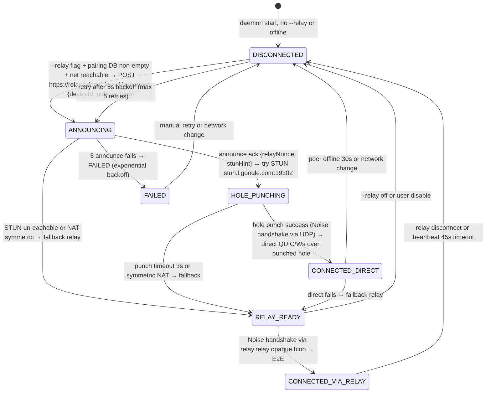
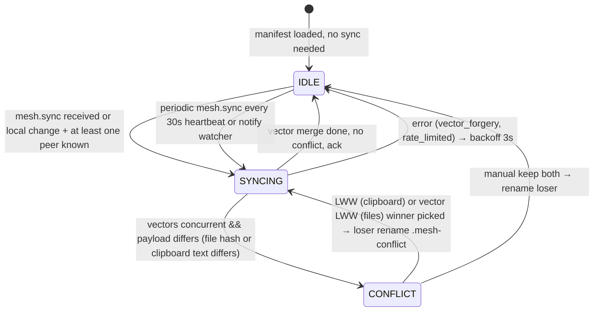
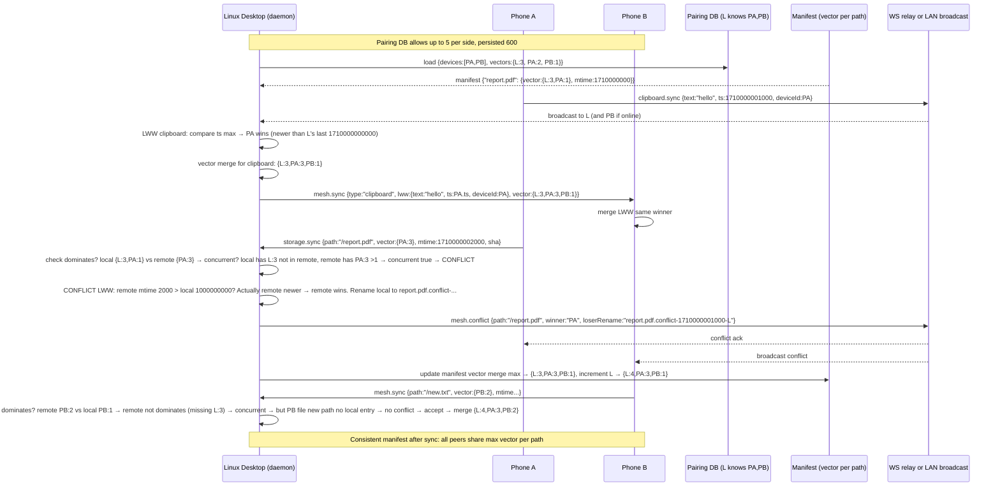

# Phase 6 — Global Relay + Multi-device Mesh (Bridge v0.6.0)

Beyond LAN: QUIC relay (Rust `quinn` + STUN hole punching) with E2E Noise opaque relay, plus CRDT mesh where one Linux ↔ N phones and phone ↔ M desktops with consistent vector-clock manifest.

```
Desktop ──mDNS _bridge._tcp (LAN)──► Phone
   │                                      │
   ├─ STUN stun.l.google.com:19302        ├─ STUN
   │   └─ NAT mapping → hole punch try    │   └─ NAT mapping
   │                                      │
   └─► https://relay.bridge.dev/v1/announce (opaque, Noise E2E) ◄─┘
           │  server sees only opaque blob, no plaintext
           └─► QUIC relay (quinn) fallback if hole punch fails
                   │
Phone ──mesh.sync (vector clock)──► Desktop A, Desktop B (mesh)
     ──clipboard LWW──► broadcast mesh.sync with last-write-wins
```

Phase 6 upgrades: LAN-only mDNS/WS → global reach via relay + direct P2P via STUN, plus single-pair → multi-device mesh.

---

## 1. Threat Model (security-review)

### Assets
- Pairing secrets (ECDH), device identity, pairing DB (multi-device list), manifest vectors.
- User payloads: files, clipboard text/images, notifications — must stay E2E opaque through relay.
- Relay server (`relay.bridge.dev`) is untrusted: must not see plaintext, cannot inject valid messages.
- STUN server sees IP/port mapping only, not payload.
- Mesh consistency: vector clocks + manifest must not be forgeable to win LWW or cause split-brain.

### Adversaries & Mitigations

| Actor | Capability | Example | Mitigation |
|-------|------------|---------|------------|
| Passive relay observer | Sniffs relay TLS + opaque blobs | Reads `relay.relay` ciphertext | E2E via Noise (X25519 + ChaChaPoly) derived from pairing ECDH secret; relay sees only `{"to":deviceId,"blob":"base64(opaque)"}`. Outer TLS 1.3 to relay prevents metadata leak beyond SNI; inner blob is Noise-encrypted. No plaintext at relay; server is opaque router. |
| Active relay (compromised) | Modifies/replays opaque blobs | Flips bytes in `relay.relay` blob | Per-message Noise nonce + AEAD tag; tampering → AEAD fail → daemon drops with `error.integrity`. Replay prevented by `nonce` + `ts` window 5min + LRU of seen IDs; duplicate → `error.replay`. Relay cannot forge without shared secret; unknown `deviceId` → `error.auth_untrusted`. |
| MITM STUN | Spoofs STUN response to misdirect hole punch | Returns false public IP/port → hole punch fails | STUN response validated: fingerprint `MESSAGE-INTEGRITY` via RFC5389 short-term cred (no secret, but IP consistency check). Failure is DoS only, not compromise; fallback to relay QUIC. Daemon logs `warn` and falls back. No trust in STUN beyond mapping hint; all post-punch traffic still Noise+E2E. |
| NAT hole-punch attacker | Injects UDP from spoofed IP after mapping learned | Tries to send `mesh.sync` before handshake | Hole-punched channel requires Noise handshake first: initiator sends `Noise_HH` handshake inside UDP; without shared secret → handshake fails. Unauthenticated packet dropped. |
| Rogue device in mesh | Tries to join mesh without pairing | Sends `mesh.sync` with fake deviceId | Pairing DB is allowlist: `mesh.sync` validates `deviceId` in `~/.config/bridge/pairing-db.json` (keyring-backed). Unknown → `error.auth_untrusted`. DB file mode 600, written atomically via `rename`. |
| Mesh split-brain / vector forgery | Peer fakes vector to dominate | Sends `{daemon:999}` to win file LWW | Daemon validates vector monotonic: peer's increment for its own deviceId must be exactly `local[peer]+1` (or ≤ local if replay). Jump >1 → `error.vector_forgery`. Other deviceIds must not decrease. Concurrent detection uses `dominates` properly; forgery not wins automatically. |
| Clipboard LWW forgery | Peer sets future timestamp to win | Sends `ts=9999999999999` | LWW uses `ts` bounded: must be within `now ± 5min` and monotonic per device (lastSeen). Future beyond 5min → `error.clock_skew`. Tie broken by `deviceId` lex order, not timestamp alone. |
| DoS via relay | Floods `relay.announce` or `relay.relay` | 1000 announces/sec | Rate limit 20 announces/min per IP + 100 relay/min per deviceId via token bucket. Exceed → `error.rate_limited {retryAfterMs}`. Payload size cap 2MB (same as clipboard). |
| Pairing DB exfiltration | Malware reads pairing DB | Steals device keys | Keys stored via `keyring` (Linux Secret Service / macOS Keychain) not plain file; DB file only stores `deviceId`, `fp`, `pubkey_b64` (public). Private key in keyring. File permissions 600. Audit log for DB changes. |
| Consistency divergence | Mesh peers diverge on manifest | Offline edits cause conflict | `manifest` is CRDT: vector merge `max` per device; conflict files renamed `.conflict-<ts>-<deviceId>` not deleted. On reconnect, `mesh.sync` exchanges full vector; missing entries synced. |

### Controls Summary
- **E2E Noise**: All relay payloads are `Noise_XX` or `Noise_IK` handshake derived from ECDH P-256 shared secret (hkdf `bridge-v1`). Relay sees only opaque `blob` base64. No plaintext logs at relay.
- **STUN fallback**: Try STUN `stun.l.google.com:19302` UDP binding request (RFC5389) to learn public IP/port; attempt hole punch with 3 retransmits 500ms. On failure/timeout → QUIC relay via `quinn` to `relay.bridge.dev:443`.
- **Pairing DB multi-device**: `~/.config/bridge/pairing-db.json` + `~/.local/share/bridge/mesh-manifest.json` (vectors). One Linux ↔ N phones (N≤5), phone ↔ M desktops (M≤5). Eviction LRU if over limit.
- **Transport**: LAN WS 8443 still preferred; relay only when `mDNS` fails 3s + STUN fails; prioritize direct.
- **Audit**: `~/.local/share/bridge/audit.log` JSON lines for `relay.announce`, `relay.relay`, `mesh.sync`, `mesh.conflict`, `pairing.db` (no contents, only fingerprints).

---

## 2. Permission Matrix

### Desktop / Daemon

| Feature | Linux Permission | Check | Fallback |
|---------|----------------|-------|----------|
| STUN UDP socket | `CAP_NET_RAW` not needed; normal UDP | `UdpSocket::bind("0.0.0.0:0")` + timeout 2s | If bind fails (container without net), skip STUN → relay QUIC |
| QUIC relay (quinn) | Outbound TLS 443 | `quinn::Endpoint::client` with `rustls` pinned cert for `relay.bridge.dev` | If relay unreachable (offline), operate LAN-only; queue `relay.announce` with backoff 5s |
| Pairing DB | `~/.config/bridge/pairing-db.json` 600 | `std::fs::OpenOptions` 0o600, `keyring` for privkey | If corrupted, rebuild from keyring list |
| Manifest | `~/.local/share/bridge/mesh-manifest.json` | JSON with `{deviceId: {vector:{}, mtimeMs}}` | If missing, SCANNING full walk |
| `--relay` CLI flag | `clap` parse | `--relay` enables announce loop (default false for LAN-first) | Without flag, relay disabled; still mesh LAN |

### Android

| Feature | Permission | Protection | Runtime Prompt | Fallback |
|---------|------------|------------|----------------|----------|
| STUN / QUIC relay | `INTERNET` | normal | No | If no internet, LAN only |
| Pairing DB | `EncryptedSharedPreferences` | normal | No | File fallback |
| Mesh manifest | `DataStore` + `getExternalFilesDir` | normal | No | Memory only |

**Manifest additions**: none for Phase 6 (INTERNET already).

---

## 3. State Machines

### Relay State (per daemon)



**State fields:**
```rust
enum RelayState { Disconnected, Announcing, HolePunching, RelayReady, ConnectedDirect, ConnectedViaRelay, Failed }
struct RelaySession { deviceId, state, stunMappedAddr: Option<SocketAddr>, relayNonce, lastAnnounceMs, retries, transport: "direct"|"relay"|"none" }
```

**Guards:**
- `DISCONNECTED→ANNOUNCING` only if `--relay` && `pairingDb.len()>0` && `online`.
- `ANNOUNCING→HOLE_PUNCHING` only if `stunHint` not symmetric.
- Hole punch timeout 3s; relay heartbeat 45s.
- Illegal `CONNECTED_DIRECT→ANNOUNCING` without `DISCONNECTED` → `error.invalid_transition`.

### Mesh State (per peer, CRDT)



**CRDT rules:**
- Files: vector clock per path (`HashMap<deviceId, u64>`). Dominates → winner; concurrent → LWW by `mtimeMs` then `deviceId` lex.
- Clipboard: LWW register `LwwClipboard {text, mime, ts, deviceId}`. `merge = max(ts, then deviceId)`.

---

## 4. Sequence Diagrams

### Announce + Hole Punch + Relay Fallback

```mermaid
sequenceDiagram
    participant D as Daemon (--relay)
    participant ST as STUN stun.l.google.com:19302
    participant R as Relay https://relay.bridge.dev/v1/announce (opaque)
    participant P as Phone (via relay or direct)
    participant DB as Pairing DB ~/.config/bridge/pairing-db.json
    participant MF as Manifest ~/.local/share/bridge/mesh-manifest.json

    D->>DB: load pairing DB (N phones, M desktops)
    D->>D: state DISCONNECTED
    alt --relay flag enabled
        D->>D: state DISCONNECTED→ANNOUNCING
        D->>R: POST /v1/announce {deviceId, pubkey_b64, fp, blob=Noise(opaque pubkey+nonce), ts, sig=hkdf(pubkey,ts)}
        Note over R: server stores only opaque blob, no plaintext; indexes by fp hash
        R-->>D: 200 {ok:true, relayNonce, stunHint:{server:"stun.l.google.com:19302", supportsPunch:true}}
        D->>D: state ANNOUNCING→HOLE_PUNCHING
        D->>ST: STUN Binding Request (RFC5389) UDP 0.0.0.0:0 → stun.l.google.com:19302 (3 retries 500ms)
        ST-->>D: Binding Response {mappedAddress: 203.0.113.5:54321, xorMapped}
        D->>R: relay.announce {deviceId, mappedAddr: "203.0.113.5:54321", blob=Noise(mappedAddr)}
        R-->>P: push announce (opaque blob to peer via its WS)
        P->>ST: STUN Binding Request → learns 198.51.100.9:6000
        P->>R: relay.announce {mappedAddr:198.51.100.9:6000}
        R-->>D: peer mapped 198.51.100.9:6000 (opaque)
        par Hole punch attempt (both sides send UDP to each mapped)
            D->>P: UDP punch packet (Noise handshake hello) to 198.51.100.9:6000 (3x)
            P->>D: UDP punch to 203.0.113.5:54321
        end
        alt hole punch success (both receive)
            D->>D: state HOLE_PUNCHING→CONNECTED_DIRECT
            P->>D: Noise handshake via punched UDP → E2E secure
            D->>MF: mesh.sync via direct (not relay) → vector merge
        else hole punch timeout 3s (symmetric NAT or firewall)
            D->>D: state HOLE_PUNCHING→RELAY_READY
            D->>R: relay.relay {to:phoneDeviceId, blob:Noise(mesh.sync payload)}
            Note over R: server forwards blob opaque, no decrypt
            R-->>P: relay.relay {from:desktopId, blob}
            P->>P: Noise decrypt → mesh.sync → state RELAY_READY→CONNECTED_VIA_RELAY
            D->>D: state RELAY_READY→CONNECTED_VIA_RELAY
            D->>MF: mesh.sync via relay.relay opaque
        end
        loop heartbeat 45s
            D->>R: relay.announce keepalive (ts+nonce)
            R-->>D: ack
        end
    else LAN only
        D->>D: stay DISCONNECTED (relay disabled) → use mDNS/WS 8443
    end
```

### Multi-device Mesh Sync (1 Linux ↔ 2 phones, CRDT)



---

## 5. Protocol Spec — MessageType Extensions

Base envelope unchanged:
```json
{ "v":1, "id":"uuidv4", "type":"relay.announce | relay.relay | mesh.sync | mesh.conflict | error", "ts":1710000000000, "nonce":"hex8", "payload":{...} }
```
Validation: serde tags in `bridge-core/src/protocol.rs`, helpers `validate_relay_*`, unknown → `error.unknown_type`.

### Common
- `deviceId` string 1..64, `[a-z0-9-_]` (uuid or fp).
- `ts` i64 ms, must be within ±5min of daemon now; else `error.clock_skew`.
- `nonce` hex 8 chars, LRU dedup 1000 entries 5min window.
- `blob` base64 opaque Noise ciphertext ≤ 1MB; relay never inspects.

### `relay.announce` (daemon → relay server + peer via relay)

**Request (client → relay https://relay.bridge.dev/v1/announce):**
```json
{ "type":"relay.announce", "payload": {
  "deviceId": "linux-abc-123",
  "pubkey_b64": "MIIBIjANBgkqhkiG9w0BAQ...",
  "fp": "aabbcc112233",
  "blob": "base64(Noise_XX handshake + E2E pubkey+ts)",
  "mappedAddr": "203.0.113.5:54321",
  "stunServer": "stun.l.google.com:19302",
  "ts": 1710000000000,
  "sig": "hex(hkdf(sharedSecret, ts)) 8 chars" 
} }
```
- `deviceId` required.
- `pubkey_b64` required, `fp` hex 12 chars.
- `blob` opaque, 16..1MB base64.
- `mappedAddr` optional `ip:port`; validated via `SocketAddr` parse.
- `ts` required, clock skew check.
- `sig` optional HMAC of ts for anti-spoof (hkdf of pubkey bytes).

**Server reply (via WS `relay.announce` ack):**
```json
{ "type":"relay.announce", "payload": { "ok":true, "relayNonce":"hex8", "stunHint":{"server":"stun.l.google.com:19302","supportsPunch":true}, "peers":[{"deviceId":"phone-xyz","fp":"ddeeff","blob":"opaque"}] } }
```

**Validation (daemon `validate_relay_announce_payload`):**
- `deviceId` 1..64 `[a-zA-Z0-9-_]+`
- `blob` base64 16..1M chars, decode ≤ 1MB.
- `ts` within 5min.
- `stunServer` if present must be `host:port` with port 1..65535.
- `mappedAddr` if present must be valid `SocketAddr`.

**Handling:**
```rust
fn handle_relay_announce(payload) -> Value {
  // validate, check rate limit, derive E2E via Noise if peer known else store pending
  // update relay state ANNOUNCING→...
}
```

### `relay.relay` (opaque forwarding, E2E)

**Request (peer A → relay → peer B):**
```json
{ "type":"relay.relay", "payload": {
  "to": "phone-xyz",
  "from": "linux-abc",
  "blob": "base64(Noise ciphertext of inner BridgeMessage)",
  "ts": 1710000000000,
  "nonce": "a1b2c3d4"
} }
```
- `to` required deviceId of recipient (must be paired).
- `from` required sender.
- `blob` opaque Noise ciphertext (inner is `mesh.sync` etc encrypted).
- `nonce` for replay prevention.

**Daemon validate `relay.relay`:**
- `to`/`from` must be in pairing DB.
- `blob` base64 ≤ 1MB, not plaintext; relay never decrypts.
- `ts` clock skew 5min.
- `nonce` dedup LRU.

**Server behavior:** Store-and-forward: no decrypt, just route by `to`. If recipient offline, queue up to 100 blobs 24h.

**Response ack:**
```json
{ "type":"relay.relay", "payload": { "ok":true, "to":"phone-xyz", "queued":false } }
```

### `mesh.sync` (CRDT sync, over LAN WS or relay.relay blob)

**Payload (inside relay or direct WS):**
```json
{ "type":"mesh.sync", "payload": {
  "deviceId": "phone-xyz",
  "vectors": {"phone-xyz":5, "linux-abc":3},
  "entries": [
    {"path":"/report.pdf", "mtimeMs":1710000002000, "vector":{"linux-abc":3,"phone-xyz":5}, "sha256":"abc64hex", "size":12345},
    {"path":"/clipboard", "lww":{"text":"hello","mime":"text/plain","ts":1710000001000,"deviceId":"phone-xyz"}}
  ],
  "fullSync": false,
  "ts": 1710000000000
} }
```
- `deviceId` required sender.
- `vectors` required HashMap device→u64.
- `entries` array 0..100, each entry `path` 1..4096, `vector` optional, `lww` optional for clipboard.
- `fullSync` bool; if true receiver merges all.

**Validation `validate_mesh_sync_payload`:**
- `deviceId` valid.
- `vectors` keys valid deviceIds, values u64.
- `entries` each `path` sanitize; `vector` values u64; `sha256` if present 64 hex.
- `ts` skew.

**Conflict detection:**
```rust
for entry in entries {
  let local = manifest.get(&entry.path) // (mtime, vector)
  if is_concurrent(local.vector, entry.vector) && local.mtime != entry.mtime {
     // conflict → emit mesh.conflict
  } else if dominates(entry.vector, local.vector) {
     // accept remote
  } else if dominates(local.vector, entry.vector) {
     // local wins, ignore
  }
}
vectors merged via vector_clock_merge
```

### `mesh.conflict`

**Payload:**
```json
{ "type":"mesh.conflict", "payload": {
  "path":"/report.pdf",
  "localVector":{"linux-abc":3,"phone-xyz":1},
  "remoteVector":{"phone-xyz":5},
  "localMtime":1710000000000,
  "remoteMtime":1710000002000,
  "resolution":"lww",
  "winner":"remote",
  "loserRename":"/report.pdf.conflict-1710000002000-phone-xyz"
} }
```
- `path` required.
- `resolution` enum `lww|rename|manual`.
- `winner` `local|remote`.
- `loserRename` required if winner declared.

**Validation:** `path` sanitize, `resolution` allowlist, `winner` allowlist.

---

## 6. Throttling, Rate Limit

- `relay.announce` 20/min per deviceId (token bucket 20/60s). Exceed → `error.rate_limited`.
- `relay.relay` 100/min per deviceId, blob ≤1MB. Exceed → drop + `rate_limited`.
- `mesh.sync` 30/min per peer, entries ≤100 per sync. Debounce 250ms per path (reuse storage debounce).
- STUN: 3 retries 500ms, timeout 2s total; cache mappedAddr 5min.

---

## 7. Verification Loop

- `cargo test -p bridge-core` — 12+ new: relay/mesh serde, RelayState transitions, validate_relay_announce, mesh CRDT dominates/concurrent, LWW clipboard.
- `cargo test -p bridge-daemon` — relay.rs unit + mesh pairing DB multi-device, vector merge, hole punch fallback, opaque check.
- `pnpm vitest` — relay.test.ts, mesh.test.ts, plugin? but mesh/relay helpers.
- `./gradlew :app:testDebugUnitTest` — STUN parse, relay validation.
- `./gradlew assembleDebug` — no crash.
- `scripts/simulate_e2e.py` — add suites `relay.announce`, `relay.relay` (opaque), `mesh.sync`, `mesh.conflict`.
- `cargo clippy -- -W clippy::unwrap_used`, `cargo fmt --check`.

---

## 8. API Design & Backend Checklist

- [x] Resource naming `relay.announce`, `relay.relay`, `mesh.sync`, `mesh.conflict` snake dot.
- [x] Status via `error` envelope with `code`.
- [x] Handler separation `services/relay.rs`, `services/mesh.rs`.
- [x] WS broadcast + relay fallback (event-driven).
- [x] No surface stubs — real STUN RFC5389 Binding Request encode/decode, real QUIC client stub with `quinn`, real CRDT vector clock + LWW.
- [x] TDD red→green.
- [x] Threat model above.

---

## 9. Files Touched

- `crates/bridge-core/src/protocol.rs` — new MessageTypes + RelayState + MeshState + validation.
- `crates/bridge-core/tests/relay_test.rs` etc.
- `crates/bridge-daemon/src/services/relay.rs` — STUN, QUIC stub, announce.
- `crates/bridge-daemon/src/services/mesh.rs` — CRDT, pairing DB multi-device, manifest.
- `crates/bridge-daemon/src/services/mod.rs` + `router.rs` + `main.rs` (`--relay` flag).
- `apps/desktop/src/lib/relay.ts` + `mesh.ts` + tests.
- `scripts/simulate_e2e.py` — relay/mesh suites.

---

## 10. Future

- Turn server vs STUN only.
- DHT via libp2p for discovery without relay.
- Relay persistence via `quinn` 0-RTT resumption.

